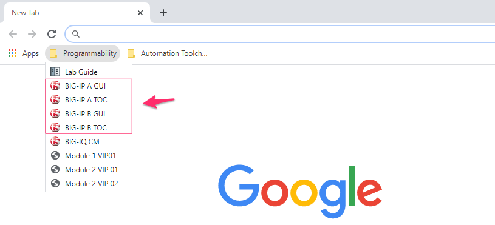
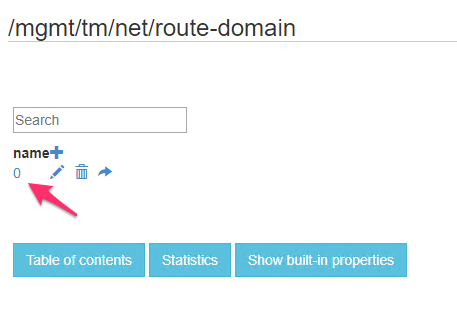

Lab 1.1: Exploring the iControl REST API
----------------------------------------

Task 1 - Explore the API using the TMOS Web Interface
~~~~~~~~~~~~~~~~~~~~~~~~~~~~~~~~~~~~~~~~~~~~~~~~~~~~~

In this lab, we will explore the API using an interface that is built into TMOS. This utility is useful for understanding how TMOS objects map to the REST API. The interfaces implement full Create, Read, Update and Delete (CRUD) functionality, however, in most practical use cases it is far easier to use this interface as a `Read` tool rather than trying to Create objects directly from it. You can use TMUI or TMSH to create the object as needed and then use this tool to view the created object with all the correct attributes already populated.

.. NOTE:: This guide may require you to Copy/Paste information from the
   guide to your jump host.  To make this more comfortable, you can open a copy of the Guide_ in the Windows jump host.

#. Open a Remote Desktop session to the Windows Jumphost (``student/automation``), ignore any update warnings.

#. Open Google Chrome and navigate to the following bookmarks under the 
   **Programmability** folder: **BIG-IP A**, and **BIG-IP B**. Bypass 
   any SSL errors that appear and ensure you see the login screen for each bookmark.

   .. WARNING:: Skipping this step will result in errors in subsequent steps

   .. WARNING:: We are using a self-signed certificate in this lab. In your environment, you must make sure that you use certificates issued by your certificate authority for both production and lab equipment. Not doing so would make it possible for an attacker to employ a man-in-the-middle attack and allow him the ability to steal passwords and tokens.

   |lab-1-1|

#. Navigate to the URL ``https://10.1.1.7/mgmt/toc`` (or click the BIG-IP A TOC bookmark). The ``/mgmt/toc`` path in the URL is available on all TMOS versions 11.6 or newer.

#. Authenticate to the interface using the default credentials (``admin/Agility2020!``)

#. You will now be presented with a top-level list of various REST resources. At the top of the page, there is a search box |lab-1-2| that can be used to find items on the page. Type ``net`` in the search box and then click on the `net` link under iControl REST Resources:

   |lab-1-3|

#. Find the ``/mgmt/tm/net/route-domain`` **Collection** and click it.

#. You will now see a listing of the **Resources** that are part of the route-domain(s) collection. As you can see, the default route domain of ``0`` is listed. You can also create new objects by clicking the |lab-1-4| button. Additionally, resources can be deleted using the |lab-1-5| button or edited using the |lab-1-7| button. The |lab-1-6| is used to copy JSON formatted resource with Ctrl + C. This can be useful when you want to change an existing resource slightly.

#. Click the ``0`` resource to view the attributes of route-domain 0 on
   the device:

   |lab-1-9|

#. You can now see the properties of the route-domain 0 Resource.  The
   components of the URI have been labeled in the screenshot below:

   |lab-1-8|

.. NOTE:: If you would like to learn more about the iControl Rest be sure to read
   the **Demystifying iControl REST** article series at
   https://devcentral.f5.com/wiki/icontrolrest.homepage.ashx

.. _Guide: https://agility-2020-programmability-big-ip-rest.readthedocs.io/

.. |lab-1-2| image:: images/lab-1-2.png
.. |lab-1-3| image:: images/lab-1-3.png
.. |lab-1-4| image:: images/lab-1-4.png
.. |lab-1-5| image:: images/lab-1-5.png
.. |lab-1-6| image:: images/lab-1-6.png
.. |lab-1-7| image:: images/lab-1-7.png
.. |lab-1-8| image:: images/lab-1-8.png

