Lab 1 Configure Standalone BIG-IP with Declarative Onboarding
==============================================================

In this lab declarative onboarding (DO) has already been installed.  For
instructions on how to install declarative onboarding (DO) please see appendix
A.

Before we jump into declarative onboarding (DO) lets take a look at the current
state of one of our **BIGIP** appliances.

Login to **BIGIP-01** and notice that it is not licensed and nothing has been
provisioned.  Also notice the hostname in the upper left hand corner.

.. list-table::
   :widths: 20 40 40
   :header-rows: 1
   :stub-columns: 1

   * - **System Type**
     - **Networks**
     - **Credentials**
   * - BIGIP-01
     - Management: 10.1.1.4
     - admin / @gi1ity2021

.. image:: images/bigip01_01.png

With the declarative onboarding (DO) package installed on BIG-IP, we are ready
to build out our first BIG-IP.

The desired end state of these DO declarations is to configure the objects
below, built on the BIG-IPs with a single call in a single file.  This
declarative solution allows us to compose configurations that are reusable with
templating technologies and storable in Source Control.

|

We will use VSCode to send our declaration to **BIGIP-01**. First, we must
configure our BIG-IP devices within the F5 VSCode extension.

|

Within the VSCode window click on the ``F5 Extension icon`` then click
``ADD HOST`` in the ``F5 HOSTS`` window.

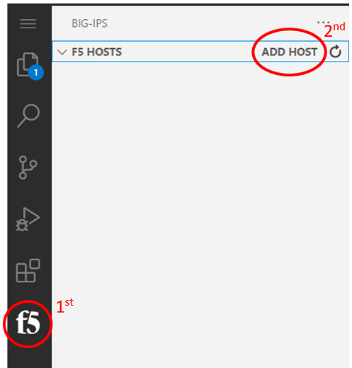

Within the add host prompt add each BIG-IP using the username@X.X.X.X format
and press enter.

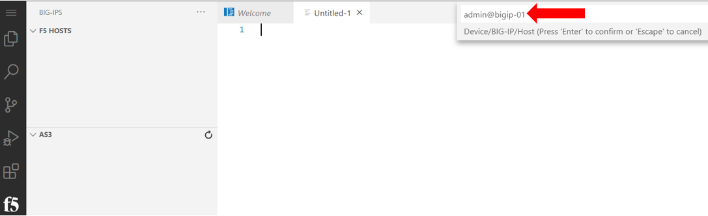

Lastly, click the device you just added and copy in the password to connect to
the device.

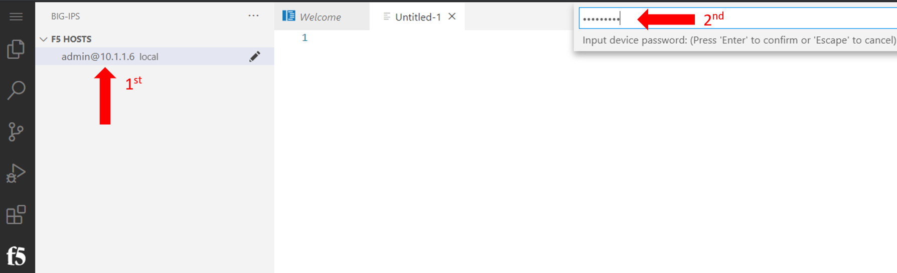

Once you have successfully connected and authenticated to the BIG-IP device
You will notice that the bottom of your VSCode window will show the
version of declarative onboarding that is installed 
(as well as other components).

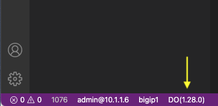

Be sure to add all three BIG-IPs and BIG-IQ to the F5 VSCode extension.

|

In our first declaration we will configure the following items on the BIG-IP:

- Licensing
- Credentials
- Provisioning
- DNS
- NTP
- Self-IPs
- Vlans

Copy **all** of the declarative onboarding (DO) declaration below.

.. code-block:: JSON

    {
        "$schema": "https://raw.githubusercontent.com/F5Networks/f5-declarative-onboarding/master/src/schema/latest/base.schema.json",
        "schemaVersion": "1.9.0",
        "class": "Device",
        "async": true,
        "label": "my BIG-IP declaration for declarative onboarding",
        "Common": {
            "class": "Tenant",
            "hostname": "bigip-01.compute.internal",
            "myLicense": {
                "class": "License",
                "licenseType": "regKey",
                "regKey": "E7135-74831-26771-18995-6988851",
                "overwrite": false
            },
            "myDns": {
                "class": "DNS",
                "nameServers": [
                    "10.1.255.254",
                    "8.8.8.8",
                    "2001:4860:4860::8844"
                ],
                "search": [
                    "us-west-2-compute.internal",
                    "f5.com"
                ]
            },
            "myNtp": {
                "class": "NTP",
                "servers": [
                    "0.pool.ntp.org",
                    "1.pool.ntp.org",
                    "2.pool.ntp.org"
                ],
                "timezone": "UTC"
            },
            "anotheradmin": {
                "class": "User",
                "userType": "regular",
                "password": "Fu11Pr0%y",
                "shell": "bash"
            },
            "guestUser": {
                "class": "User",
                "userType": "regular",
                "password": "Fu11Pr0%y",
                "partitionAccess": {
                    "Common": {
                        "role": "guest"
                    }
                }
            },
            "anotherUser": {
                "class": "User",
                "userType": "regular",
                "password": "Fu11Pr0%y",
                "shell": "none",
                "partitionAccess": {
                    "all-partitions": {
                        "role": "guest"
                    }
                }
            },
            "myProvisioning": {
                "class": "Provision",
                "ltm": "nominal",
                "gtm": "minimum"
            },
            "internal": {
                "class": "VLAN",
                "tag": 4093,
                "mtu": 1500,
                "interfaces": [
                    {
                        "name": "1.1",
                        "tagged": false
                    }
                ],
                "cmpHash": "dst-ip"
            },
            "internal-self": {
                "class": "SelfIp",
                "address": "10.1.10.100/24",
                "vlan": "internal",
                "allowService": "default",
                "trafficGroup": "traffic-group-local-only"
            },
            "internal-floating": {
                "class": "SelfIp",
                "address": "10.1.10.120/24",
                "vlan": "internal",
                "allowService": "default",
                "trafficGroup": "traffic-group-1"
            },
            "external": {
                "class": "VLAN",
                "tag": 4094,
                "mtu": 1500,
                "interfaces": [
                    {
                        "name": "1.2",
                        "tagged": false
                    }
                ],
                "cmpHash": "src-ip"
            },
            "external-self": {
                "class": "SelfIp",
                "address": "10.1.20.100/24",
                "vlan": "external",
                "allowService": "none",
                "trafficGroup": "traffic-group-local-only"
            },
            "external-floating": {
                "class": "SelfIp",
                "address": "10.1.20.120/24",
                "vlan": "external",
                "allowService": "default",
                "trafficGroup": "traffic-group-1"
            },
            "default": {
                "class": "Route",
                "gw": "10.1.10.1",
                "network": "default",
                "mtu": 1500
            },
            "configsync": {
                "class": "ConfigSync",
                "configsyncIp": "/Common/internal-self/address"
            },
            "failoverAddress": {
                "class": "FailoverUnicast",
                "address": "/Common/internal-self/address"
            },
            "failoverGroup": {
                "class": "DeviceGroup",
                "type": "sync-failover",
                "members": [
                    "bigip-01.compute.internal",
                    "bigip-02.compute.internal"
                ],
                "owner": "/Common/failoverGroup/members/0",
                "autoSync": true,
                "saveOnAutoSync": false,
                "networkFailover": true,
                "fullLoadOnSync": false,
                "asmSync": false
            },
            "trust": {
                "class": "DeviceTrust",
                "localUsername": "admin",
                "localPassword": "@gi1ity2020",
                "remoteHost": "/Common/failoverGroup/members/0",
                "remoteUsername": "admin",
                "remotePassword": "@gi1ity2020"
            }
        }
    }

F5 publishes a schema for each of the Automation Toolchain items. This
published schema can be used in Visual Studio Code allowing you to see context
and find errors within your different declarations. The schema reference is
added at the top of your declaration, and requires vscode to know the language
is JSON.

We wiil now use Visual Studio Code to validate our declaraion.

Open Visual Studio Code on and open a New File. To open a new file click the
hamburger icon, hover over ``File`` and select ``New File``.

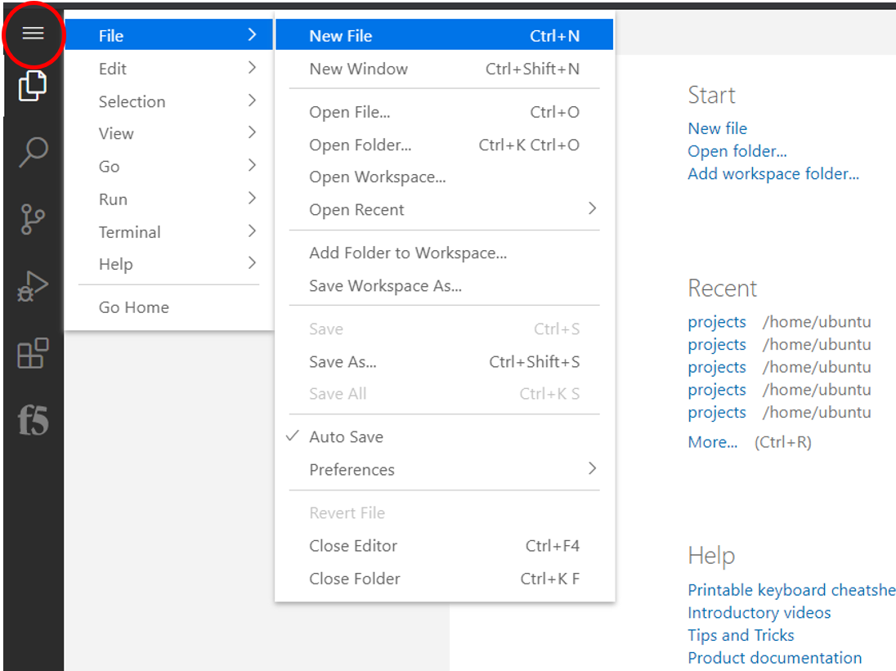

Once you have a new file open paste all of the DO declaration contents.
Additionally, the language setting in VSCode must be set to JSON. In the bottom
right on the VSCode screen, click ``plain text``. Then in the language mode
screen type ``JSON``.

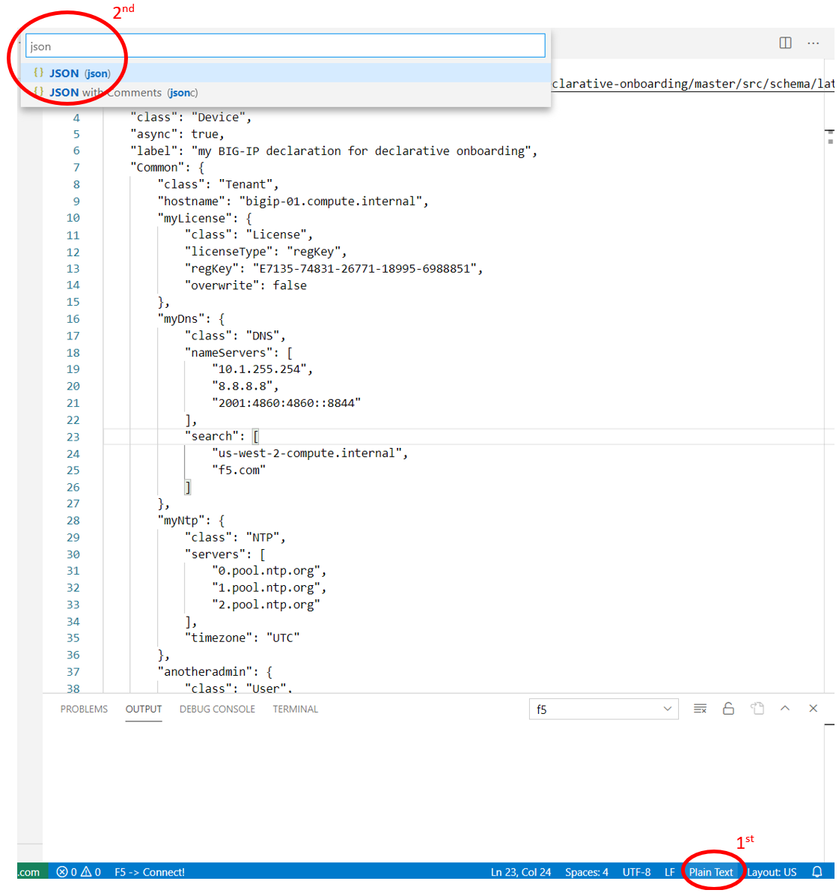

Once the declaration and language are set, you can highlight over sections of
the code to see context and errors

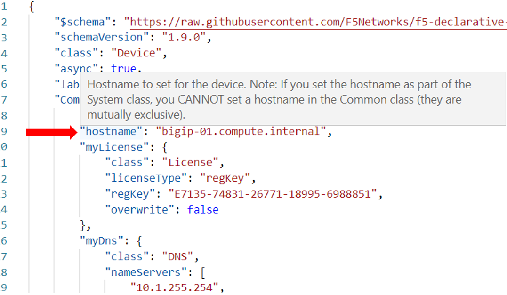

.. note::  Now that you've added the schema validation to your JSON declaration
   you can try misspelling some of the declaration objects to see errors,
   remember to  revert your changes.

We are now ready to send our declaration to **BIGIP-01**

Right click in the file editor of VSCode and select ``Post DO Declaration``.

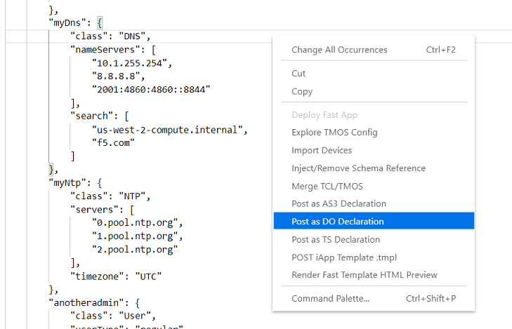

In the bottom right hand corner of VSCode you should see that the DO 
declaration is processing.

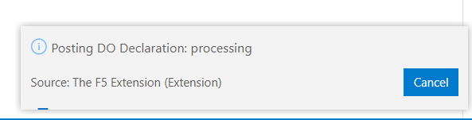

After a few moments you will receive a second tab in VSCode that shows that the
declaration is running.

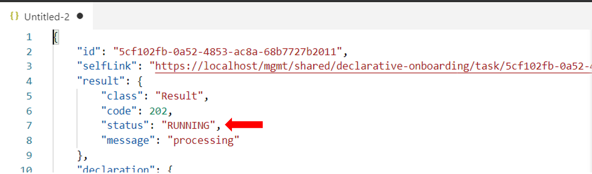

To know when the BIG-IP is finished processing the declaration click the DO
version on the status bar of VSCode.

When complete, you should receive a 200 response code, a status of OK and a
message of success

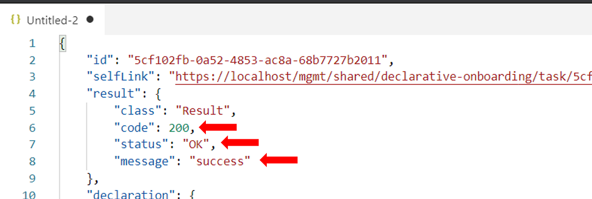

|

Once the **BIG-IP** has finished processing the declaration, login to
**BIGIP-01** and notice the host name has changed and the device is now
licensed.

.. image:: images/bigip01_02.png

|
|

Futhermore, take a look at the following settings on **BIGIP-01** to see what
all was configured with declarative onboarding (DO)

- Credentials
- Provisioning
- DNS
- NTP
- Self-IPs
- Vlans
