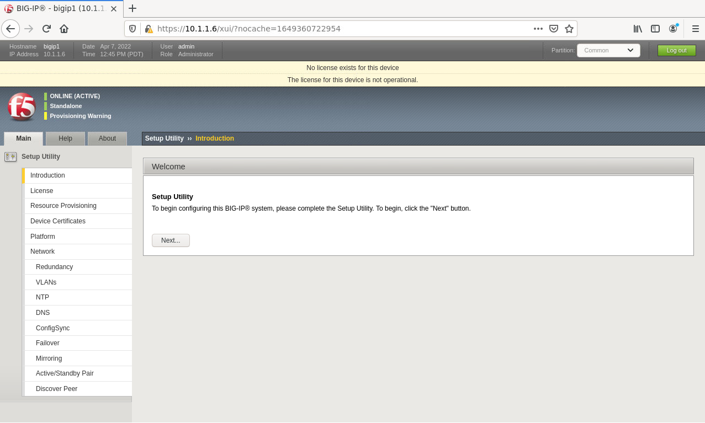

Lab 1 Configure Standalone BIG-IP with Declarative Onboarding
==============================================================

In this lab declarative onboarding (DO) has already been installed.  For
instructions on how to install declarative onboarding (DO) please see appendix
A.

Before we jump into declarative onboarding (DO) lets take a look at the current
state of one of our **BIGIP** appliances.

Login to **BIGIP-01** and notice that it is not licensed and nothing has been
provisioned.  Also notice the hostname in the upper left hand corner.

With the declarative onboarding (DO) package installed on BIG-IP, we are ready
to build out our first BIG-IP.

The desired end state of these DO configurations is to configure the objects
below, built on the BIG-IPs with a single call in a single file.  This
declarative solution allows us to compose configurations that are reusable with
templating technologies and storable in Source Control.

In our first declaration we will configure the following items on the BIG-IP:

- Licensing
- Credentials
- Provisioning
- DNS
- NTP
- Self-IPs
- Vlans

Copy **all** of the declarative onboarding (DO) declaration below.

.. code-block:: JSON

    {
        "$schema": "https://raw.githubusercontent.com/F5Networks/f5-declarative-onboarding/master/src/schema/latest/base.schema.json",
        "schemaVersion": "1.9.0",
        "class": "Device",
        "async": true,
        "label": "my BIG-IP declaration for declarative onboarding",
        "Common": {
            "class": "Tenant",
            "hostname": "bigip-01.compute.internal",
            "myLicense": {
                "class": "License",
                "licenseType": "regKey",
                "regKey": "E7135-74831-26771-18995-6988851",
                "overwrite": false
            },
            "myDns": {
                "class": "DNS",
                "nameServers": [
                    "10.1.255.254",
                    "8.8.8.8",
                    "2001:4860:4860::8844"
                ],
                "search": [
                    "us-west-2-compute.internal",
                    "f5.com"
                ]
            },
            "myNtp": {
                "class": "NTP",
                "servers": [
                    "0.pool.ntp.org",
                    "1.pool.ntp.org",
                    "2.pool.ntp.org"
                ],
                "timezone": "UTC"
            },
            "anotheradmin": {
                "class": "User",
                "userType": "regular",
                "password": "Fu11Pr0%y",
                "shell": "bash"
            },
            "guestUser": {
                "class": "User",
                "userType": "regular",
                "password": "Fu11Pr0%y",
                "partitionAccess": {
                    "Common": {
                        "role": "guest"
                    }
                }
            },
            "anotherUser": {
                "class": "User",
                "userType": "regular",
                "password": "Fu11Pr0%y",
                "shell": "none",
                "partitionAccess": {
                    "all-partitions": {
                        "role": "guest"
                    }
                }
            },
            "myProvisioning": {
                "class": "Provision",
                "ltm": "nominal",
                "gtm": "minimum"
            },
            "internal": {
                "class": "VLAN",
                "tag": 4093,
                "mtu": 1500,
                "interfaces": [
                    {
                        "name": "1.1",
                        "tagged": false
                    }
                ],
                "cmpHash": "dst-ip"
            },
            "internal-self": {
                "class": "SelfIp",
                "address": "10.1.10.100/24",
                "vlan": "internal",
                "allowService": "default",
                "trafficGroup": "traffic-group-local-only"
            },
            "internal-floating": {
                "class": "SelfIp",
                "address": "10.1.10.120/24",
                "vlan": "internal",
                "allowService": "default",
                "trafficGroup": "traffic-group-1"
            },
            "external": {
                "class": "VLAN",
                "tag": 4094,
                "mtu": 1500,
                "interfaces": [
                    {
                        "name": "1.2",
                        "tagged": false
                    }
                ],
                "cmpHash": "src-ip"
            },
            "external-self": {
                "class": "SelfIp",
                "address": "10.1.20.100/24",
                "vlan": "external",
                "allowService": "none",
                "trafficGroup": "traffic-group-local-only"
            },
            "external-floating": {
                "class": "SelfIp",
                "address": "10.1.20.120/24",
                "vlan": "external",
                "allowService": "default",
                "trafficGroup": "traffic-group-1"
            },
            "default": {
                "class": "Route",
                "gw": "10.1.10.1",
                "network": "default",
                "mtu": 1500
            },
            "configsync": {
                "class": "ConfigSync",
                "configsyncIp": "/Common/internal-self/address"
            },
            "failoverAddress": {
                "class": "FailoverUnicast",
                "address": "/Common/internal-self/address"
            },
            "failoverGroup": {
                "class": "DeviceGroup",
                "type": "sync-failover",
                "members": [
                    "bigip-01.compute.internal",
                    "bigip-02.compute.internal"
                ],
                "owner": "/Common/failoverGroup/members/0",
                "autoSync": true,
                "saveOnAutoSync": false,
                "networkFailover": true,
                "fullLoadOnSync": false,
                "asmSync": false
            },
            "trust": {
                "class": "DeviceTrust",
                "localUsername": "admin",
                "localPassword": "@gi1ity2020",
                "remoteHost": "/Common/failoverGroup/members/0",
                "remoteUsername": "admin",
                "remotePassword": "@gi1ity2020"
            }
        }
    }

F5 publishes a schema for each of the Automation Toolchain items. This
published schema can be used in Visual Studio Code allowing you to see context
and find errors within your different declarations. The schema reference is
added at the top of your declaration, and requires vscode to know the language
is JSON.

Open Visual Studio Code on your jump host desktop and open a New File and paste
all of the DO declaration contents.  Additionally, the language setting in
VSCode must be set to JSON.

.. image:: images/schemavalidation_01.png

Once the declaration and language are set, you can highlight over sections of
the code to see contect and errors

.. image:: images/schemacontext_01.png

.. note::  Now that you've added the schema validation to your JSON declaration
   you can try misspelling some of the declaration objects to see errors,
   remember to  revert your changes.

We are now ready to send our declaration to **BIGIP-01**

Expand the Declarative Onboarding Collection folder, then Declarative Onboarding
Request, lastly BIGIP-01.  Select ``Get Declarative Onboarding Version Info``

.. image:: images/postman_01.png

|

You'll notice that we are sending a GET request to the URL
**https://{{bigip-01}}/mgmt/shared/declarative-onboarding**

Select ``SEND`` to the right of the GET request field.

.. image:: images/postman_02.png

|
|

When sending a GET request to the **https://{{bigip-01}}/mgmt/shared/declarative-onboarding/info**
we get a response with the version of declarative that is currently installed.

.. image:: images/postman_03.png

|
|

Next, select the ``BIGIP-01 POST DO Declaration to Configure BIG_IP`` request
and select the ``Body`` tab.

Notice the following in the request:

#.  The request URL **https://{{bigip-01}}/mgmt/shared/declarative-onboarding**
#.  The language is set to **JSON**

.. image:: images/postman_04.png

|
|

Paste the JSON declaration into the Body of the Postman application and click ``Send``

.. image:: images/postman_05.png

|
|

In the response of the field you should see a response the the declaration is 
running.

.. image:: images/postman_06.png

|
|

In order to retrieve the status of the DO process we can send a GET request to
the same URL that we posted our declartion to. In Postman select
the ``GET Declarative Onboarding Status`` request in the BIGIP-01 folder and send the
GET request to view the status of the running process.

.. image:: images/postman_07.png

|

Send the GET request every so often until you receive a status of "OK." Once
you receive a status of "OK" the declaration has completed.

.. image:: images/postman_08.png

|

Once the **BIG-IP** has finished processing the declaration, login to
**BIGIP-01** and notice the host name has changed and the device is now
licensed.

|
|

Futhermore, take a look at the following settings on **BIGIP-01** to see what
all was configured with declarative onboarding (DO)

- Credentials
- Provisioning
- DNS
- NTP
- Self-IPs
- Vlans
