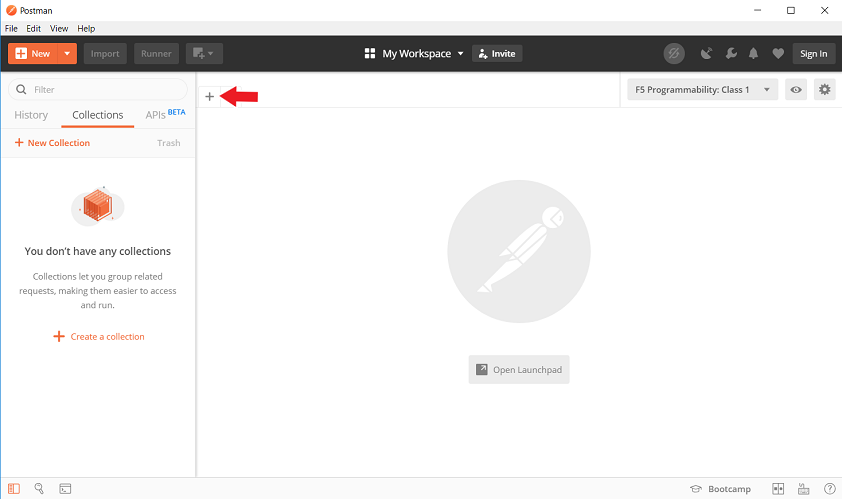

Lab 2 Configure Clustered BIG-IP with Declarative Onboarding
==============================================================

In this lab we are going to configure **BIGIP-02**.  The build out will be similar but the declaration will be slightly different than **BIGIP-01**.  There are some device specific items, like
Self-IPs that will be different between devices.  These differences illustrate examples where templatizing would work exceptionally well.  For these situation you could use a templating tool that
an orchestrator may provide such as Jinja2 in Ansible.

Below is our declaration for **BIGIP-02**.  Copy **all of** the declaration to be used in Postman.

..  code-block:: JSON

    {
        "$schema": "https://raw.githubusercontent.com/F5Networks/f5-declarative-onboarding/master/src/schema/latest/base.schema.json",
        "schemaVersion": "1.9.0",
        "class": "Device",
        "async": true,
        "label": "my clustered BIG-IP declaration for declarative onboarding",
        "Common": {
            "class": "Tenant",
            "hostname": "bigip-02.compute.internal",
            "myLicense": {
                "class": "License",
                "licenseType": "regKey",
                "regKey": "X0400-17381-92678-76392-8132569",
                "overwrite": false
            },
            "myDns": {
                "class": "DNS",
                "nameServers": [
                    "10.1.255.254",
                    "8.8.8.8",
                    "2001:4860:4860::8844"
                ],
                "search": [
                    "us-west-2-compute.internal",
                    "f5.com"
                ]
            },
            "myNtp": {
                "class": "NTP",
                "servers": [
                    "0.pool.ntp.org",
                    "1.pool.ntp.org",
                    "2.pool.ntp.org"
                ],
                "timezone": "UTC"
            },
            "anotheradmin": {
                "class": "User",
                "userType": "regular",
                "password": "Fu11Pr0%y",
                "shell": "bash"
            },
            "guestUser": {
                "class": "User",
                "userType": "regular",
                "password": "Fu11Pr0%y",
                "partitionAccess": {
                    "Common": {
                        "role": "guest"
                    }
                }
            },
            "anotherUser": {
                "class": "User",
                "userType": "regular",
                "password": "Fu11Pr0%y",
                "shell": "none",
                "partitionAccess": {
                    "all-partitions": {
                        "role": "guest"
                    }
                }
            },
            "myProvisioning": {
                "class": "Provision",
                "ltm": "nominal",
                "gtm": "minimum"
            },
            "internal": {
                "class": "VLAN",
                "tag": 4093,
                "mtu": 1500,
                "interfaces": [
                    {
                        "name": "1.1",
                        "tagged": false
                    }
                ],
                "cmpHash": "dst-ip"
            },
            "internal-self": {
                "class": "SelfIp",
                "address": "10.1.10.200/24",
                "vlan": "internal",
                "allowService": "default",
                "trafficGroup": "traffic-group-local-only"
            },
            "internal-floating": {
                "class": "SelfIp",
                "address": "10.1.10.220/24",
                "vlan": "internal",
                "allowService": "default",
                "trafficGroup": "traffic-group-1"
            },
            "external": {
                "class": "VLAN",
                "tag": 4094,
                "mtu": 1500,
                "interfaces": [
                    {
                        "name": "1.2",
                        "tagged": false
                    }
                ],
                "cmpHash": "src-ip"
            },
            "external-self": {
                "class": "SelfIp",
                "address": "10.1.20.200/24",
                "vlan": "external",
                "allowService": "none",
                "trafficGroup": "traffic-group-local-only"
            },
            "external-floating": {
                "class": "SelfIp",
                "address": "10.1.20.220/24",
                "vlan": "external",
                "allowService": "default",
                "trafficGroup": "traffic-group-1"
            },
            "default": {
                "class": "Route",
                "gw": "10.1.10.1",
                "network": "default",
                "mtu": 1500
            },
            "configsync": {
                "class": "ConfigSync",
                "configsyncIp": "/Common/internal-self/address"
            },
            "failoverAddress": {
                "class": "FailoverUnicast",
                "address": "/Common/internal-self/address"
            },
            "failoverGroup": {
                "class": "DeviceGroup",
                "type": "sync-failover",
                "members": [
                    "bigip-01.compute.internal",
                    "bigip-02.compute.internal"
                ],
                "owner": "/Common/failoverGroup/members/0",
                "autoSync": true,
                "saveOnAutoSync": false,
                "networkFailover": true,
                "fullLoadOnSync": false,
                "asmSync": false
            },
            "trust": {
                "class": "DeviceTrust",
                "localUsername": "admin",
                "localPassword": "@gi1ity2020",
                "remoteHost": "/Common/failoverGroup/members/0",
                "remoteUsername": "admin",
                "remotePassword": "@gi1ity2020"
            }
        }
    }

Next, launch Postman on your jump host and copy the JSON declaration to the body of the Postman application.

..  note::  Clustering via declarative onboarding can take a couple of minutes to sync and establish, this is normal behavior.

Return to either **BIG-IP** in Chrome and check the cluster configuration and status.  Both units should be clustered with all onboarding objects present from the declaration.
