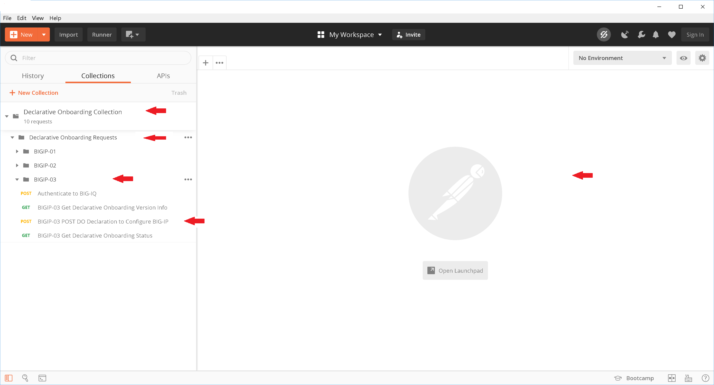
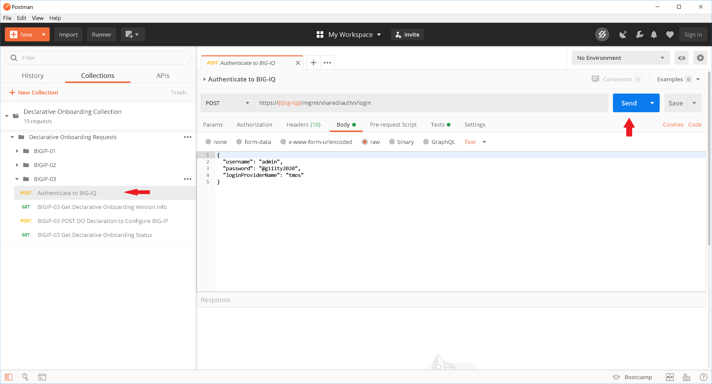
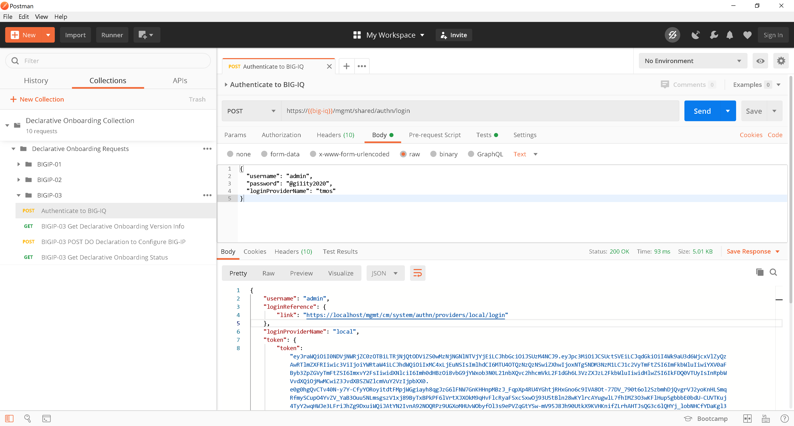
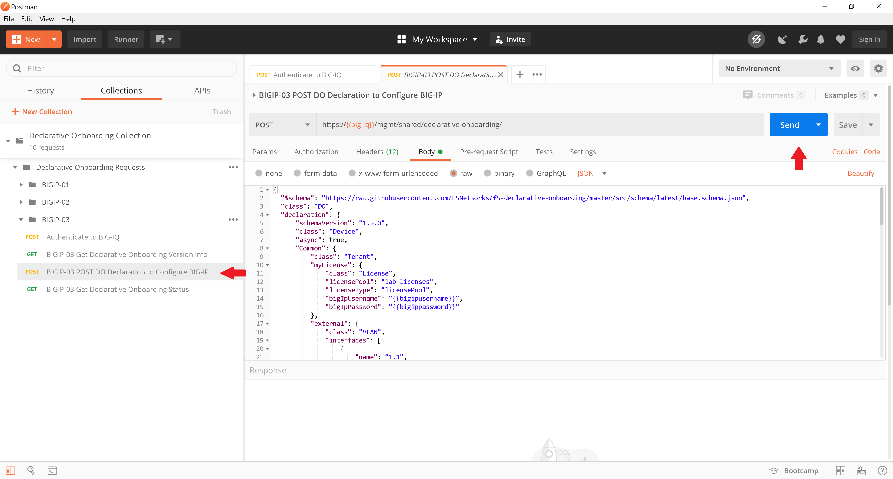
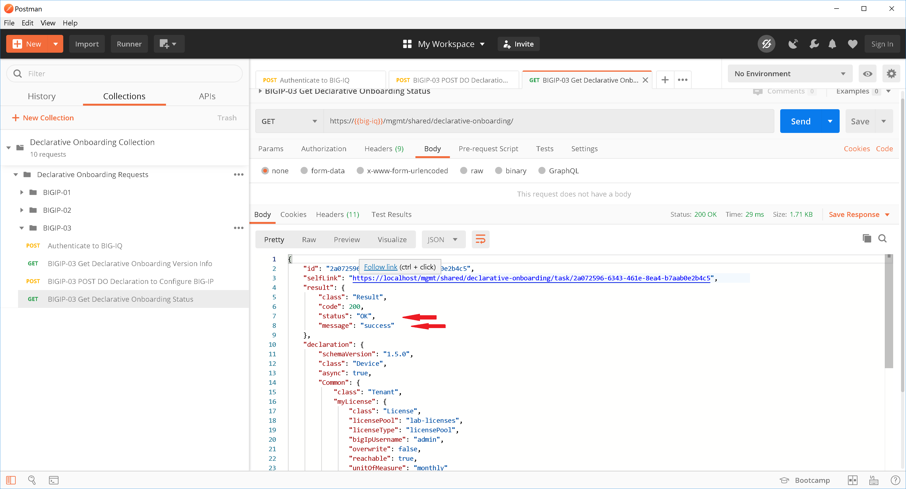
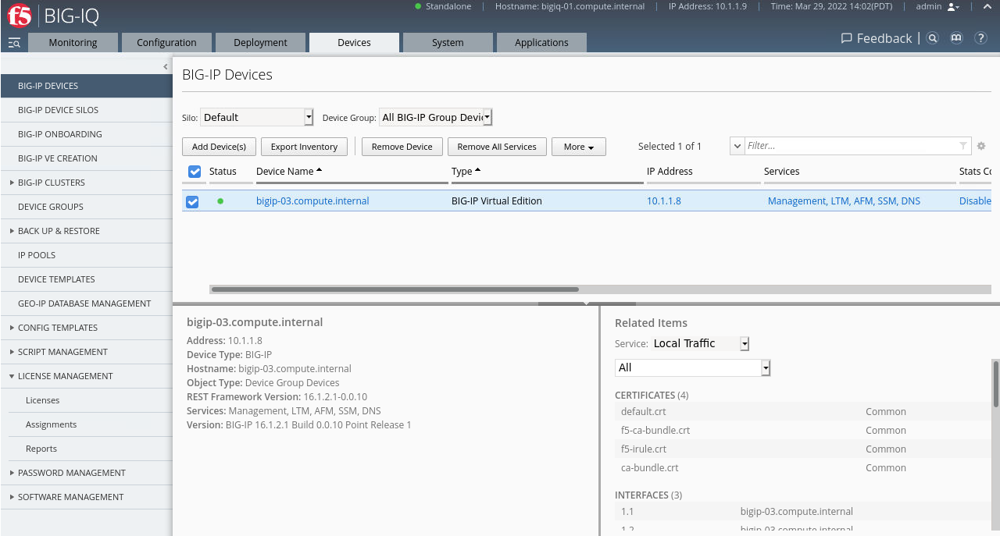

Lab 3 (Optional) Onboard a BIGIP via BIGIQ
=================================================

In the previous labs, we pushed the declaration to directly the BIGIPs . In this lab, we are going to send our JSON declaration to the BIGIQ, which will configure the BIGIP. 

Review the declartion for BIGIP-03, and notice the following changes:

- Updated license class 
- New statements to target the BIGIQ
- Introducted variables

.. code-block:: JSON

  {
    "$schema": "https://raw.githubusercontent.com/F5Networks/f5-declarative-onboarding/master/src/schema/latest/base.schema.json",
    "class": "DO",
    "declaration": {
        "schemaVersion": "1.5.0",
        "class": "Device",
        "async": true,
        "Common": {
            "class": "Tenant",
            "myLicense": {
                "class": "License",
                "licensePool": "lab-licenses",
                "licenseType": "licensePool",
                "bigIpUsername": "{{bigipusername}}",
                "bigIpPassword": "{{bigippassword}}"
            },
            "myProvisioning": {
                "class": "Provision",
                "ltm": "nominal",
                "gtm": "minimum",
                "afm": "minimum"
            },           
            "myDns": {
                "class": "DNS",
                "nameServers": [
                   "8.8.8.8",
                   "2001:4860:4860::8844"
                ],
                "search": [
                    "f5.com"
                ]
            },
            "myNtp": {
                "class": "NTP",
                "servers": [
                    "0.pool.ntp.org",
                    "1.pool.ntp.org",
                    "2.pool.ntp.org"
                ],
                "timezone": "UTC"
            },
            "external": {
                "class": "VLAN",
                "interfaces": [
                    {
                        "name": "1.1",
                        "tagged": false
                    }
                ]
            },
            "internal": {
                "class": "VLAN",
                "interfaces": [
                    {
                        "name": "1.2",
                        "tagged": false
                    }
                ]
            },
            "external-fl": {
                "vlan": "external",
                "class": "SelfIp",
                "address": "{{externalfl}}/24",
                "trafficGroup": "traffic-group-1"
            },
            "internal-fl": {
                "vlan": "internal",
                "class": "SelfIp",
                "address": "{{internalfl}}/24",
                "trafficGroup": "traffic-group-1"
            },
            "external-self": {
                "vlan": "external",
                "class": "SelfIp",
                "address": "{{host1-externalself}}/24",
                "allowService": "none"
            },
            "internal-self": {
                "vlan": "internal",
                "class": "SelfIp",
                "address": "{{host1-internalself}}/24"
            },
            "defualt": {
                "gw": "{{defaultgw}}",
                "class": "Route"
            },
            "myConfigSync": {
                "class": "ConfigSync",
                "configsyncIp": "{{host1-internalself}}"
            },
            "myFailoverUnicast": {
                "class": "FailoverUnicast",
                "address": "{{host1-internalself}}"
            },
            "hostname": "{{host1name}}"
        }
      },
      "targetUsername": "{{bigipusername}}",
      "targetHost": "{{bigip-03}}",
      "targetPort": 443,
      "targetPassphrase": "{{bigippassword}}",
      "bigIqSettings": {
        "statsConfig": {
            "enabled": true
        },
        "useBigiqSync": true,
        "conflictPolicy": "USE_BIGIQ",
        "deviceConflictPolicy": "USE_BIGIP",
        "failImportOnConflict": false,
        "versionedConflictPolicy": "KEEP_VERSION"
      }
  }

Copy the entire declaration, and launch Postman on your host. Open the Declarative Onboarding Collection folder, then Declarative Onboardig Request, lastly BIGIP-03. 

Paste the declaration into the Body of the Postman application and click ``Save``.

.. image:: images/postman_12.png

Click the ``Authenticate to BIG-IQ`` tab to request an authentication token from the BIGIQ, and click ``Send``. 

Postman returns the token which can be viewed in the results panel.

Select the previously saved declaration by clicking ``BIGIP-03 POST DO Declaration to Configure BIG-IP``, and hit ``Send``.

Use the ``GET Declaration Onboarding Status`` and monitor the declaration. Continue to monitoring till the status changes to OK and message equals success. 

Login into the BIGIQ at https://10.1.1.9, navigate to Devices, and BIG-IP Devices. BIGIP-O3 is now apart of the BIGIQ device inventory. U/P: admin/@gi1ity2020

Login into BIGIP-03 at https://10.1.1.8, and review the configurations. U/P: admin/@gi1ity202