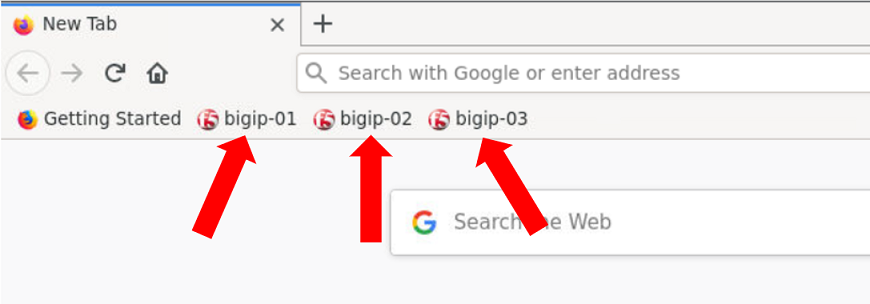
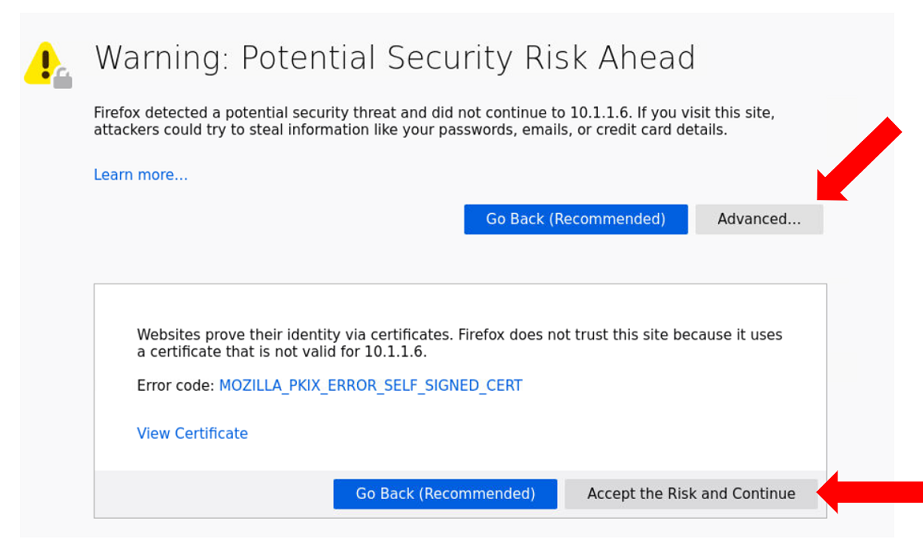

Getting Started
===============

Lab Components
--------------

The following table lists the virtual appliances in the lab along with their
networks and credentials to use.

.. list-table::
   :widths: 20 40 40
   :header-rows: 1
   :stub-columns: 1

   * - **System Type**
     - **Networks**
     - **Credentials**
   * - BIGIP-01
     - Management: 10.1.1.4
     - admin / @gi1ity2021
   * - BIGIP-02
     - Management: 10.1.1.7
     - admin / @gi1ity2021
   * - BIGIP-03
     - Management: 10.1.1.8
     - admin / @gi1ity2021
   * - BIGIQ
     - Management: 10.1.1.9
     - admin / @gi1ity2021

Starting the Lab
----------------

In order to complete this lab, you will use the F5 Extension within VSCode, and you
will use a firefox browser. A jumphost should not be required to complete this lab.
In the instructions below, you'll find the necessary information to access
VSCode, Firefox, and the lab guide. 

**Exercise 1 - Launch VSCode and Firefox browser**

#. Click on the ``Deployment`` link in the upper left corner of the browser.

   .. image:: images/udf_deployment.png

#. Under ``Systems`` find the Ubuntu client and click ``Access``,
   then click ``VSCode``. VSCode will open in a new tab.

   .. image:: images/udf_systems.png

#. Under ``Systems`` find the Ubuntu client and click ``Access``,
   then click ``Firefox``. Firefox will open in a new tab. Yes, this is a
   browser in a browser.

   .. image:: images/udf_systems02.png

#. Congratulations! You have now launched VSCode and Firefox and are ready
   to begin the lab!

|

Using browser to connect to BIGIP UI
------------------------------------

When using Firefox there are three shortcuts to each appliance
for your convenience.

|

Bypass any security warning you may receive by clicking ``Advanced`` in the
browser, then clicking ``Proceed``

