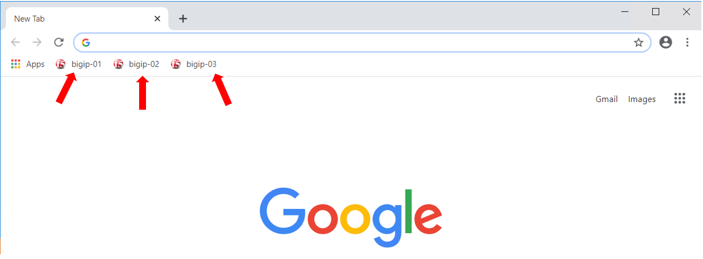
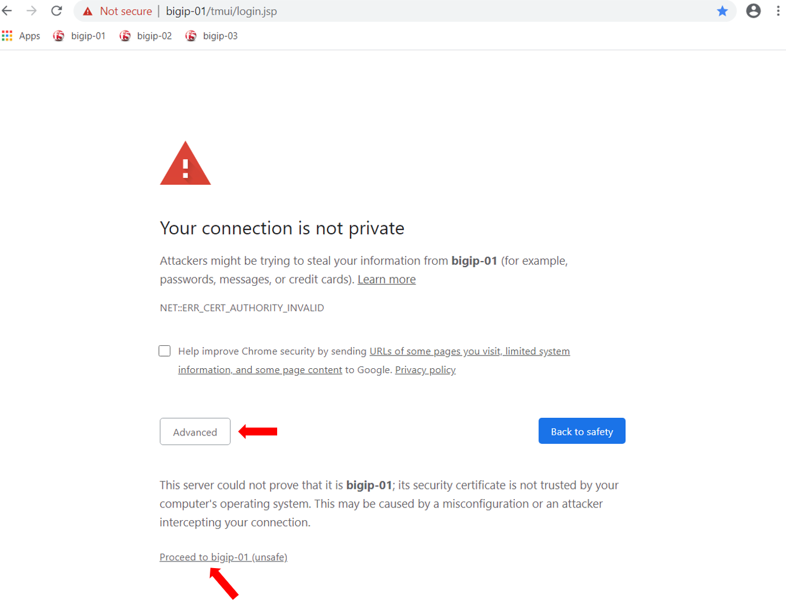

Getting Started
===============

Lab Components
--------------

The following table lists the virtual appliances in the lab along with their
networks and credentials to use.

.. list-table::
   :widths: 20 40 40
   :header-rows: 1
   :stub-columns: 1

   * - **System Type**
     - **Networks**
     - **Credentials**
   * - BIGIP-01
     - Management: 10.1.1.4
     - admin / @gi1ity2020
   * - BIGIP-02
     - Management: 10.1.1.7
     - admin / @gi1ity2020
   * - BIGIP-03
     - Management: 10.1.1.8
     - admin / @gi1ity2020
   * - BIGIQ
     - Management: 10.1.1.9
     - admin / @gi1ity2020     
   * - Windows Server
     - Management: 10.1.1.5
     - Administrator / brwP61Ag

Starting the Lab
----------------

In order to complete this lab, you will connect to a Windows jump host, and you
will perform all steps from there.  In the instructions below, there are steps
to connect to that jump host first, then you will complete the other steps from
there. You can open the lab guide from the Windows jump host in order to make
it easier to follow the rest of the lab.

**Exercise 1 - Login to Windows jump host**

#. Click on the ``Deployment`` link in the upper left corner of the browser.

   .. image:: images/udf_deployment.png

#. Under ``Systems`` find the Windows Server 2016 Base and click ``Access``,
   then click the desired resolution for the RDP session.  If prompted, select option to ``Save`` RDP file. The
   RDP file will be downloaded to your local machine.

   .. image:: images/udf_systems.png

#. Open the RDP file downloaded in the previous step and click ``Connect``
   when prompted.

   .. image:: images/win2019_rdp_connect.png

#. Enter credentials: Administrator / @gi1ity2020 then click ``OK``

   .. image:: images/win2019_rdp_credentials.png

#. When prompted, click ``Yes`` to connection, and session will be established
   to Windows host.
   
   .. image:: images/win2019_rdp_yesconnect.png

#. Congratulations! You are now connected to your Windows jump host.

|

Using browser to connect to BIGIP UI
------------------------------------

When using Chrome on your jumphost there are three shortcuts to each appliance
for your convenience.

|

Bypass any security warning you may receive by clicking ``Advanced`` in the
browser, then clicking ``Proceed``

