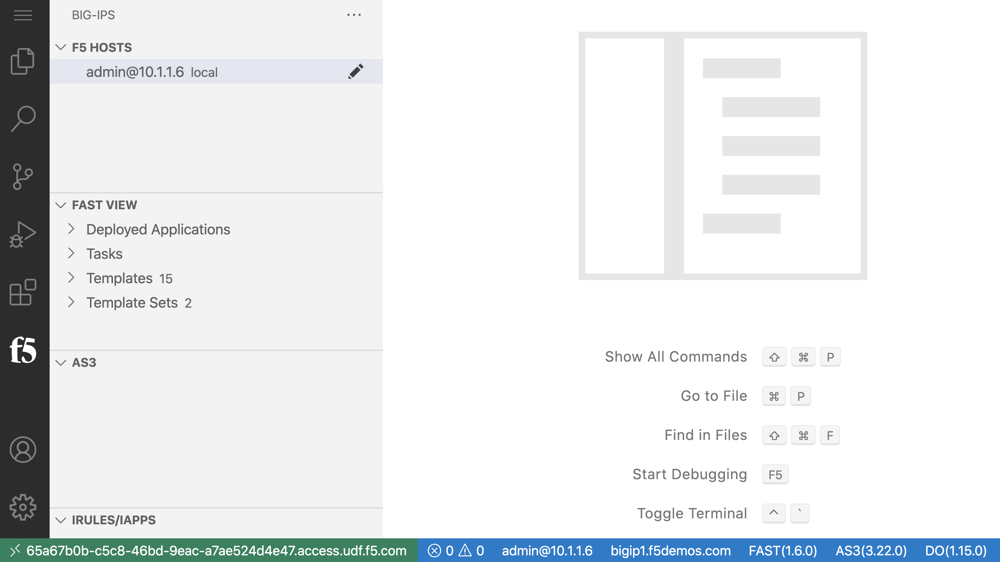
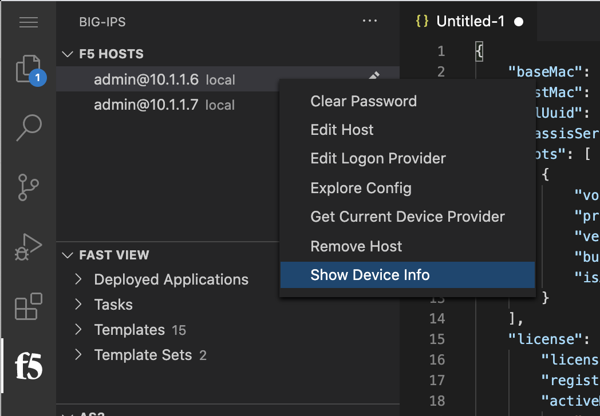
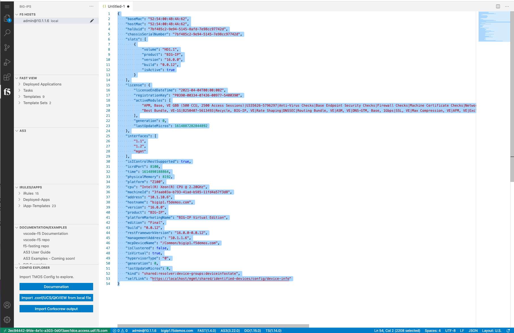
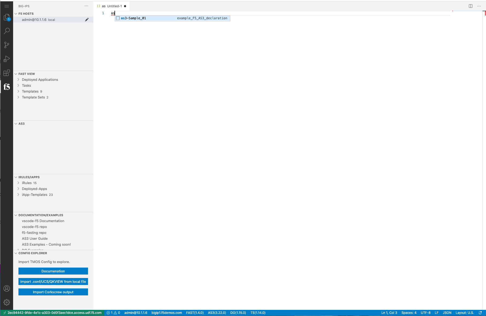
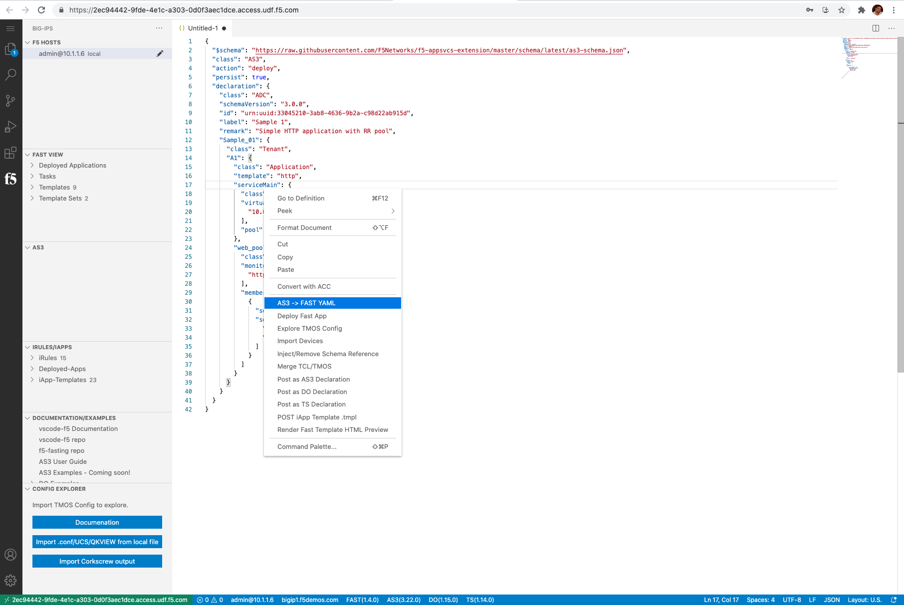
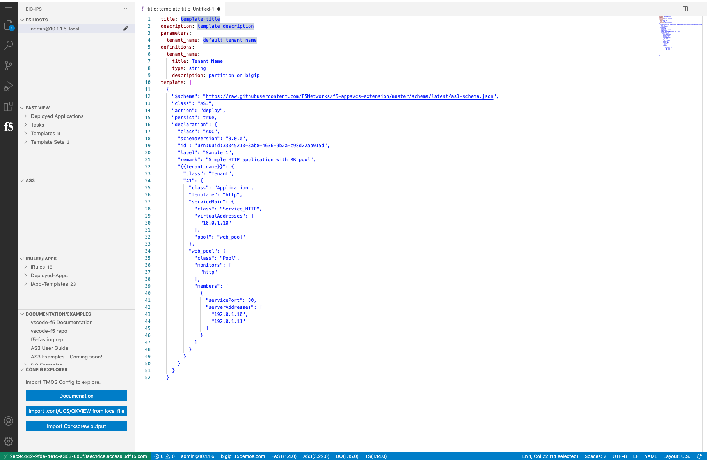

Lab 4 - Creating FAST Template for future app deployments
=========================================================

Connecting to F5 Devices
------------------------

#. F5 Device connection information for reference in the following tasks

   bigip1 - mgmt - 10.1.1.6 - admin/admin

#. Connect to bigip1 in the vscode-f5 extension

#. Click on the ``bigip1.f5demos.com`` at the bottom of the window

    This shows the ``/mgmt/shared/identified-devices/config/device-info`` output, but also provides a json editor

#. Select All, delete.

    We need to delete all the next in the window to prepare for the next step

Install FAST template on BIG-IP
-------------------------------

#. Connect to admin@10.1.1.6 by clicking the device in the F5 HOSTS view
   Press F1, then type f5 install
   Select FAST
   Select latest version (or 1.6.0)

The vscode-f5 extension quieries the repos for the different ATC version to consistantly provide an update to date list. Once a version is selected, the extension will download the necessary assets to the local machine (in this case the linux host vscode is running on), then it will upload and install the ATC ILX RPM on the F5. The install happens rather quickly, but it can take another 30-60 seconds for all the servcies to restart and present the changes.

After everything is complete, the vsocde-f5 extension should reconnect and refresh all the details

Notice that FAST now shows as installed (with version number) along the bottom of the editor

Templatize Simple AS3 to FAST YML
----------------------------------
#. From the VScode click on the F5 logo on the left to access F5 HOST

#. Right clock on the F5 Host to Display Show Device Info 

  
#. Issue a Command A to highlight and Esc to Delete or clear the contents

#. Type as3 in the window and select as3-sample file or copy the Sample AS3 file

.. literalinclude:: oo.json
  :language: JSON

.. code block:: 
   {
	"$schema": "https://raw.githubusercontent.com/F5Networks/f5-appsvcs-extension/master/schema/latest/as3-schema.json",
	"class": "AS3",
	"action": "deploy",
	"persist": true,
	"declaration": {
		"class": "ADC",
		"schemaVersion": "3.0.0",
		"id": "urn:uuid:33045210-3ab8-4636-9b2a-c98d22ab915d",
		"label": "Sample 1",
		"remark": "Simple HTTP application with RR pool",
		"Sample_01": {
			"class": "Tenant",
			"A1": {
				"class": "Application",
				"template": "http",
				"serviceMain": {
					"class": "Service_HTTP",
					"virtualAddresses": [
						"10.0.1.10"
					],
					"pool": "web_pool"
				},
				"web_pool": {
					"class": "Pool",
					"monitors": [
						"http"
					],
					"members": [{
						"servicePort": 80,
						"serverAddresses": [
							"192.0.1.10",
							"192.0.1.11"
						]
					}]
				}
			}
		}
	}
}

#. Remaining on the Same window Right Click and Select AS3 to FAST YML Option

#. You will get the YML template as shown below

=======
Create AS3 (from Lab03) to FAST YML
-----------------------------------
#. Click on the F5 logo on the left to access F5 HOST

Upload FAST(zip package)  to BIG-IP
-----------------------------------

Render YAML template locally
----------------------------

Templatize AS3 with WAF Policy to FAST YML
------------------------------------------

Upload FAST(zip package) to BIG-IP
----------------------------------

Deploy FAST YML (WAF policy) to BIG-IP using VSCode
---------------------------------------------------

Deploy FAST YML (WAF policy) to BIG-IP using GUI
------------------------------------------------
