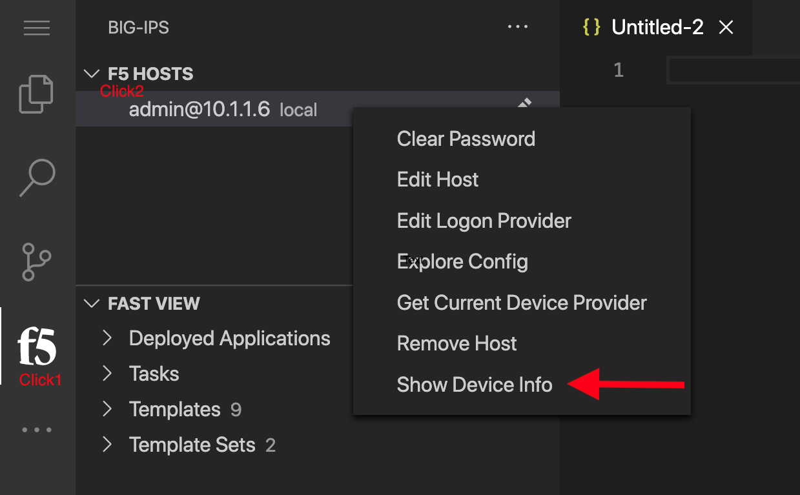
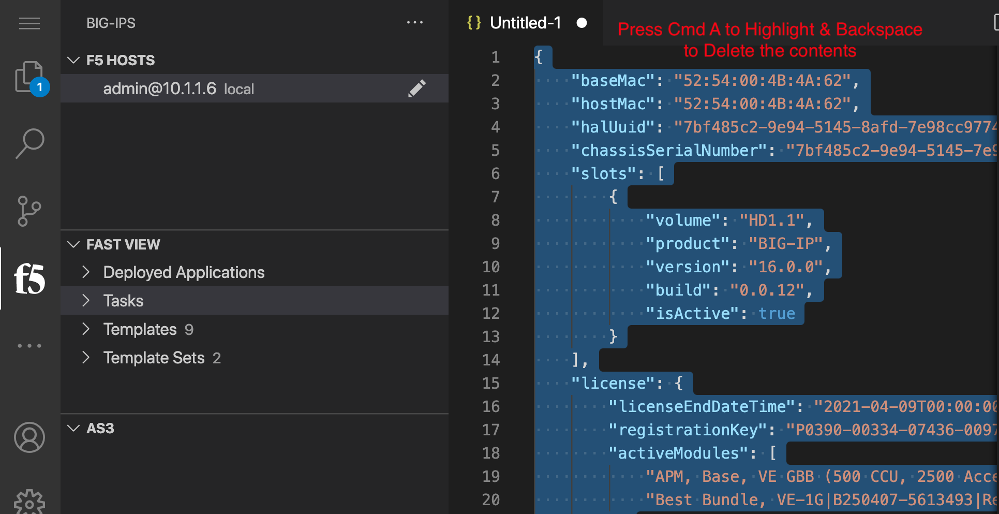
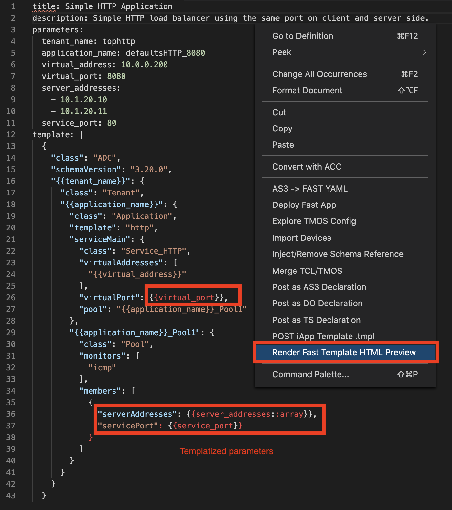
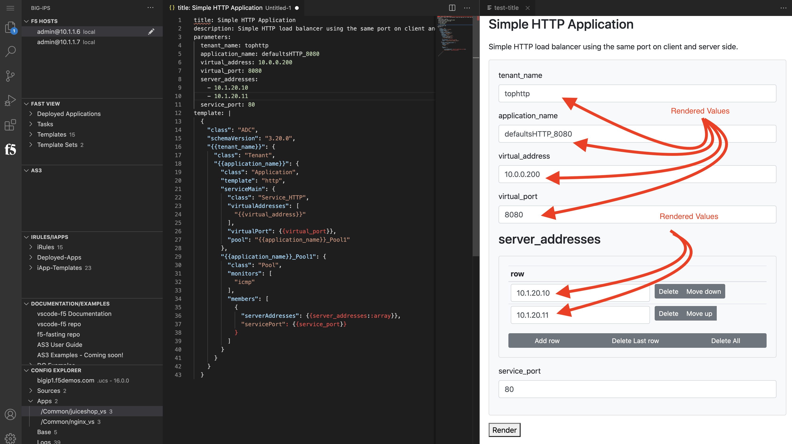
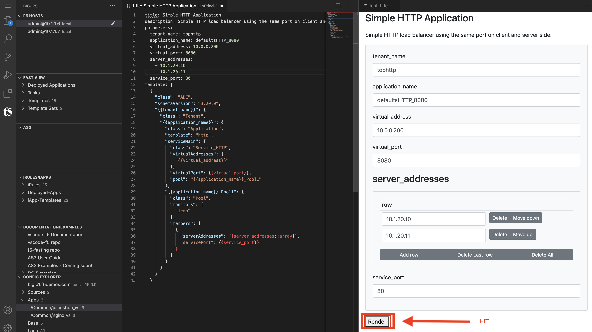
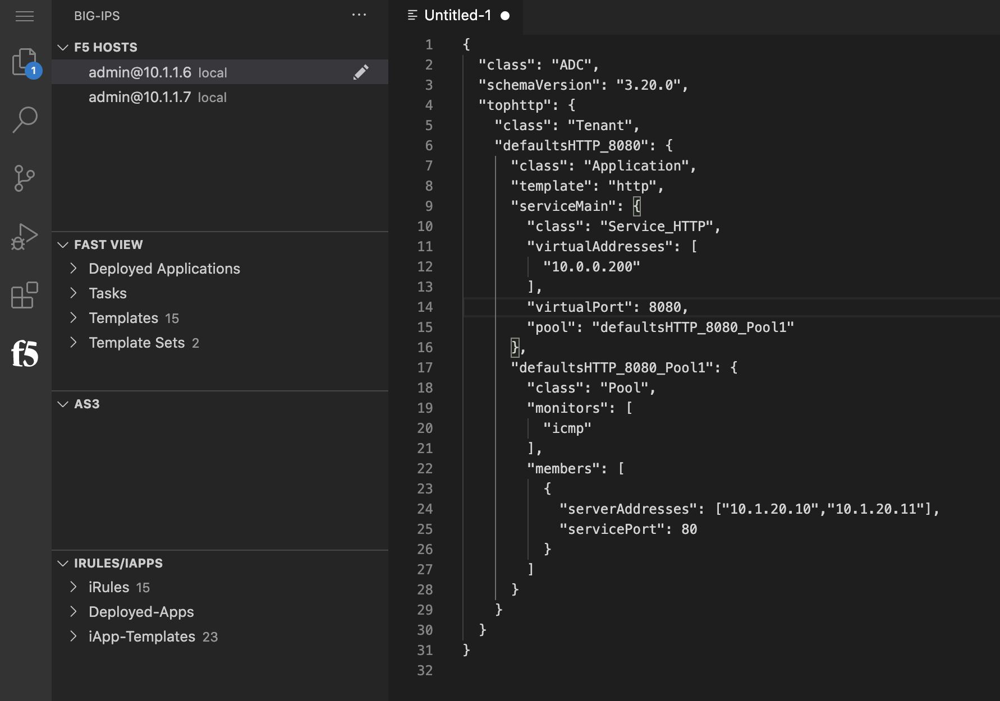
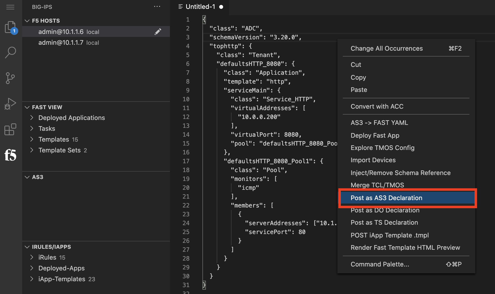
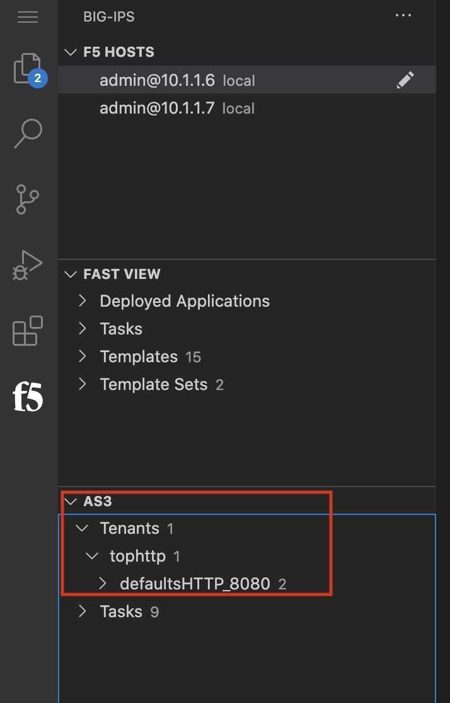
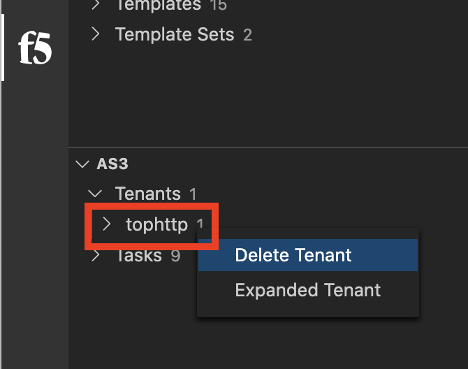

Lab 4 - Creating FAST Template for future app deployments
=========================================================

Connecting to F5 Devices
------------------------

#. F5 Device connection information for reference in the following tasks

   bigip1 - mgmt - 10.1.1.6 - admin/admin

#. Connect to bigip1 in the vscode-f5 extension

#. Click on the ``bigip1.f5demos.com`` at the bottom of the window

    This shows the ``/mgmt/shared/identified-devices/config/device-info`` output, but also provides a json editor

#. Select All, delete.

    We need to delete all the next in the window to prepare for the next step

Install FAST template on BIG-IP
-------------------------------

#. Connect to admin@10.1.1.6 by clicking the device in the F5 HOSTS view
   Press F1, then type f5 install
   Select FAST
   Select latest version (or 1.6.0)

The vscode-f5 extension quieries the repos for the different ATC version to consistantly provide an update to date list. Once a version is selected, the extension will download the necessary assets to the local machine (in this case the linux host vscode is running on), then it will upload and install the ATC ILX RPM on the F5. The install happens rather quickly, but it can take another 30-60 seconds for all the servcies to restart and present the changes.

After everything is complete, the vsocde-f5 extension should reconnect and refresh all the details

Notice that FAST now shows as installed (with version number) along the bottom of the editor

Templatize Simple AS3 to FAST YML
----------------------------------
- From the VScode click on the F5 logo on the left to access F5 HOST

-  Right clock on the F5 Host to Display Show Device Info 

  
-  Issue a Command A to highlight and Esc to Delete or clear the contents

#. Copy the Simple HTTP YAML file

.. image:: ../images/searchas3.png

.. literalinclude:: http.yml
  :language: YAML

- Remaining on the VScode, Render FAST template HTML review 

- Review the Simple HTTP Application details 

- Click on the Render TAB to see the AS3 generated 

- Review the generated AS3

- Remaining on VScode Right Click to POST the AS3 to BIG-IP

- Remaining on VScode Click on the AS3 tab --> Tenant 1 you can see your tophhtp 1 Application 

- Go to UDF bigip1 access Click on TMUI to access bigip1, you can see your application is deployed.

- Access BIG-IP1 by logging into the GUI to review the configuration, Select partition as tophttp1 to see the details

- Clean up the tenant after use, remianing at VScode right click on the tophttp1 tenant and delete

Templatize AS3 with WAF Policy to FAST YML
------------------------------------------

Upload FAST(zip package) to BIG-IP
----------------------------------

Deploy FAST YML (WAF policy) to BIG-IP using VSCode
---------------------------------------------------

Deploy FAST YML (WAF policy) to BIG-IP using GUI
------------------------------------------------
