Module |labmodule|\, Lab \ |labnum|\: CI with Ansible Tower
===========================================================

Lab scenario:
~~~~~~~~~~~~~

|image1|

F5 Declarative Onboarding, Application Services 3, and Telemetry Streaming are solutions that function well within templated environments. The use of single declarative configuration files and idempotent solutions create scenarios where systems with proper testing can progress from Continuous Delivery to Continuous Deployment.

Ansible Tower is being utilized in this lab to show the possibility of an orchestration engine with capabilities for large scale deployments. Tower has many features that will not be covered in this lab; however, two concepts that **are** covered are `Projects` and `Templates`.

Objects highlighted in this module.

 - A Project_ is a logical collection of Ansible playbooks, represented in Tower.
 - A job Template is a definition and set of parameters for running an Ansible job.

The entirety of this lab is in Source Control, with different tools using different parts. Postman imported our collection directly from Source Control, the documentation and configuration examples are also pulled from the same source, giving a real example of `Source-of-Truth`. We are now going to integrate Module 5 of this lab into Ansible Tower.

Our BIG-IP units are in a non-configured default state. There is **no license, networking, accounts, or service configurations**. Before beginning the labs below, log in to the BIG-IP units and follow along as parts of the lab are being built out.

    Using `Chrome` navigate to the ``Automation Toolch. . .`` bookmark folder and open a tab to each BIG-IP.

    - BIG-IP User: ``admin``
    - BIG-IP Password: ``Agility2020!``

  |image20|

BIG-IP State:

  |image24|

Task |labmodule|\.\ |labnum|\.1
~~~~~~~~~~~~~~~~~~~~~~~~~~~~~~~

Similar to the configuration of HashiCorp Consul at the beginning of the lab, Ansible Tower need to be configured for use. Within the Postman collection for the lab is an Ansible Tower folder containing all the pieces needed to make Tower functional.

.. Note:: If you would like to see the state of Tower before sending in the configuration, log in with the credentials below.

    Using `Chrome` navigate to the ``Automation Toolch. . .`` bookmark folder and open a tab to Ansible Tower.

    - Ansible Tower User: ``admin``
    - Ansible Tower Password: ``Agility2020!``

From Postman, expand the ``Ansible Tower > Provisioning Tower`` folder.

  |image17|

Select ``Step 1: Modify. . .`` and Send the request to Ansible tower.

  |image18|

After you have sent in the first request, proceed with sending in **all** the requests, ending with ``Step 9: Create. . .``

.. Note:: This collection of calls to Ansible Tower will License the product, create our Project, Inventory, Host, and several templates each designed around our declarations for F5 Declarative Onboarding, Application Services 3 and Telemetry Streaming.

.. Warning:: There is a template designed which will build everything in the lab, this is placed here to show a full end to end solution, however, if executed you would be done in 12 minutes missing out in all the fun.

Task |labmodule|\.\ |labnum|\.2
~~~~~~~~~~~~~~~~~~~~~~~~~~~~~~~

Ansible Tower utilizing Projects connected to an SCM will parse a Source Control repository looking for an `ansible.cfg` file, this file presents logical paths for objects used in the Project.

Using `Chrome` navigate to the `Automation Toolch...` bookmark folder and open a tab to Ansible Tower.

- Ansible Tower User: ``admin``
- Ansible Tower Password: ``Agility2020!``

  |image3|

Task |labmodule|\.\ |labnum|\.3
~~~~~~~~~~~~~~~~~~~~~~~~~~~~~~~

Ansible Tower version is `Tower 3.6.1` Ansible Version is `Ansible 2.9.2`.

  |image19|

Updating Ansible Tower from Source Control.

Navigate to `Projects`.

  |image4|

Navigate to the `f5_automation_toolchain_project`.

  |image5|

The project pulls in its configuration from GitHub, and the `SCM URL` is the repository containing all our lab. Other Update settings are used because we create templated objects (jinja2 files), which we want to be cleared out on an update, removing overlapping configuration issues.

  |image6|

The repository for this lab is public_, ansible.cfg instructs Ansible Tower where it needs to lookup Ansible specific object (Roles and Playbooks)

  |image7|

Return to the `Projects` Tab and scroll to the bottom of the page. We need to update our Ansible Tower from Source Control, as our source goes through changes we want to make sure whatever we are working with is the most current.

``Update`` from source by clicking on the loop icon.

  |image8|

This operation triggers an Ansible Tower `Job` to get the current configuration, this is viewed in `Jobs` and tagged as an `SCM Update`.

  |image9|

Navigating into the Job exposes the tasks and console of how the job performed.

  |image10|

.. |labmodule| replace:: 5
.. |labnum| replace:: 1
.. |labdot| replace:: |labmodule|\ .\ |labnum|
.. |labund| replace:: |labmodule|\ _\ |labnum|
.. |labname| replace:: Lab\ |labdot|
.. |labnameund| replace:: Lab\ |labund|

.. |image1| image:: images/image1.png
   :width: 200px
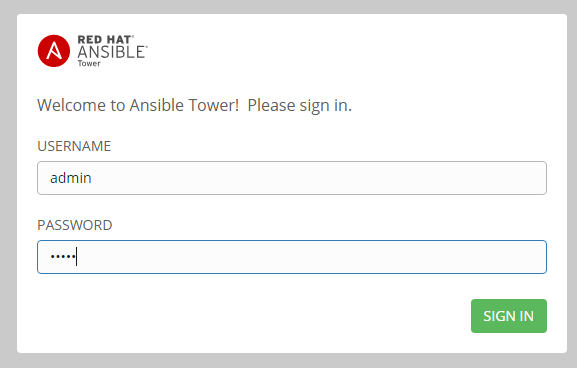
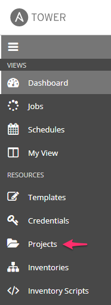
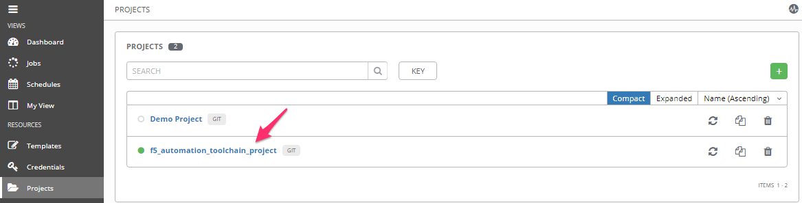
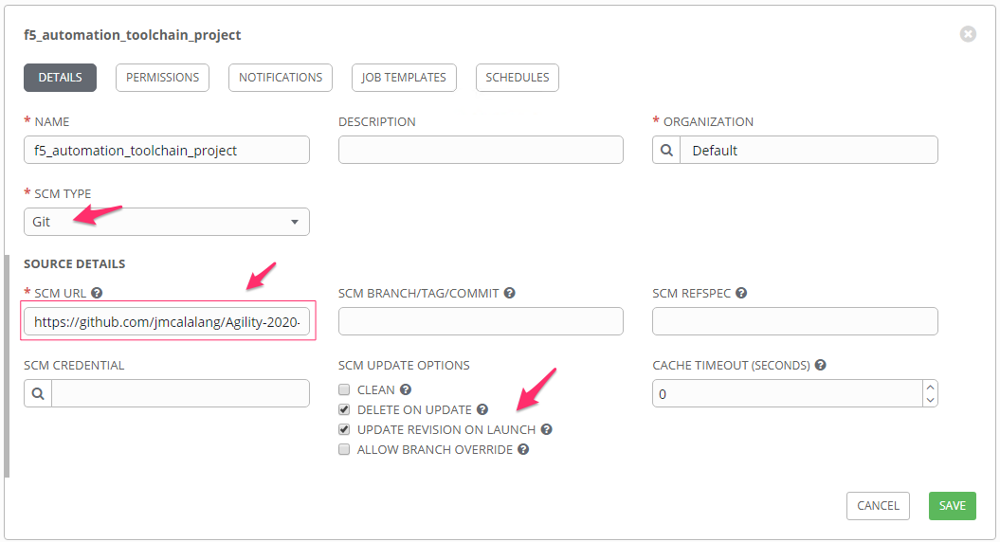
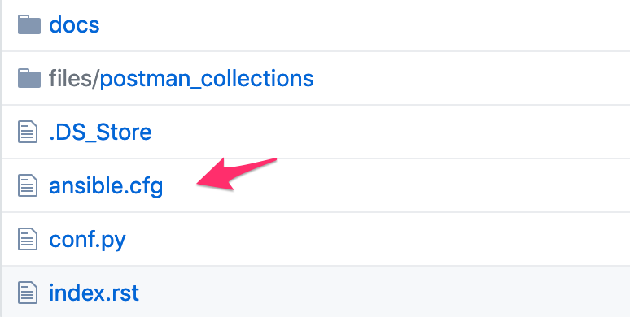
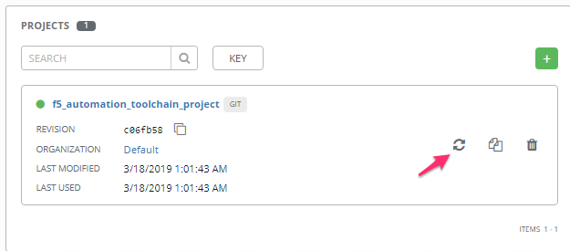
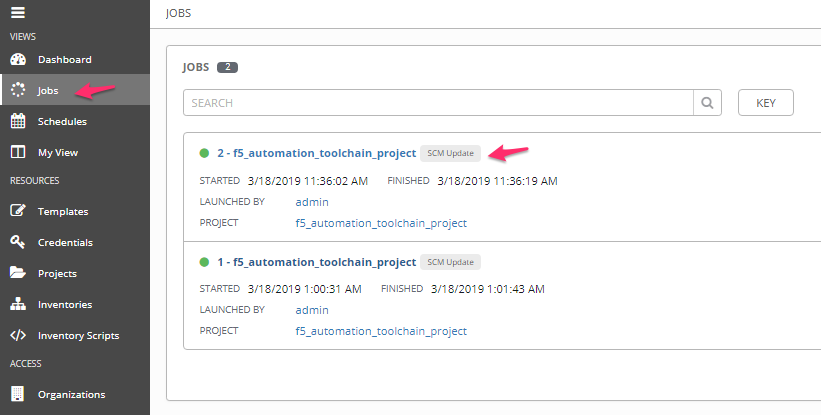
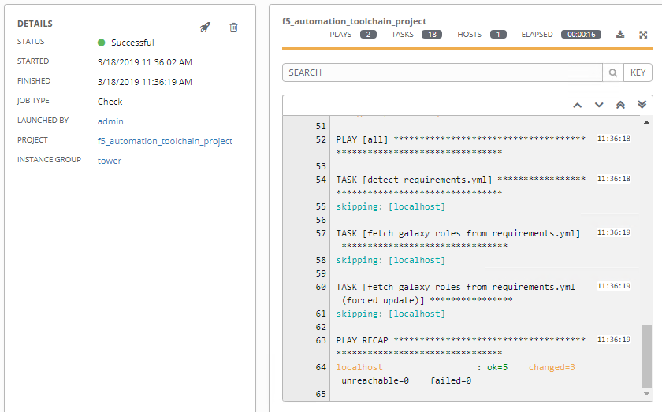
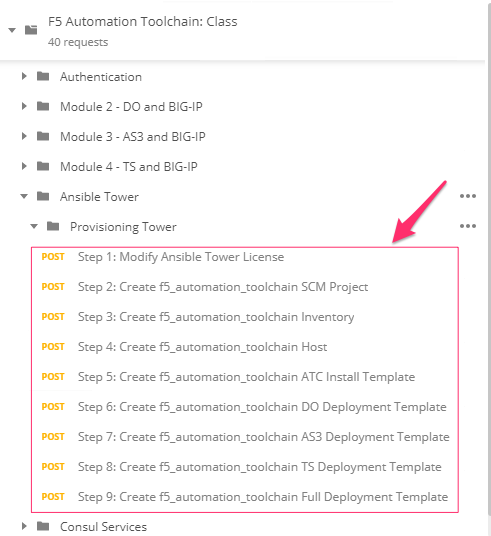
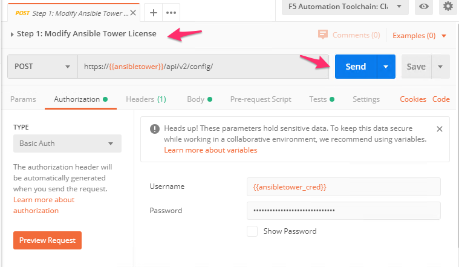
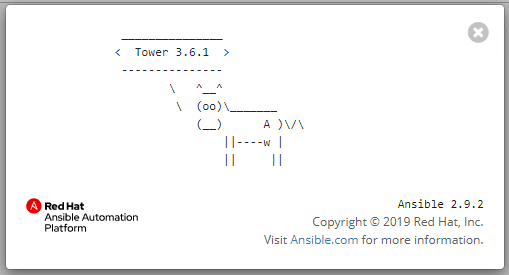
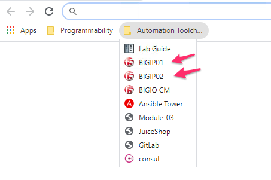
.. |image24| image:: images/image24.png

.. _Project: https://docs.ansible.com/ansible-tower/latest/html/userguide/projects.html
.. _public: https://raw.githubusercontent.com/f5devcentral/f5-agility-labs-automation/master/docs/class05
