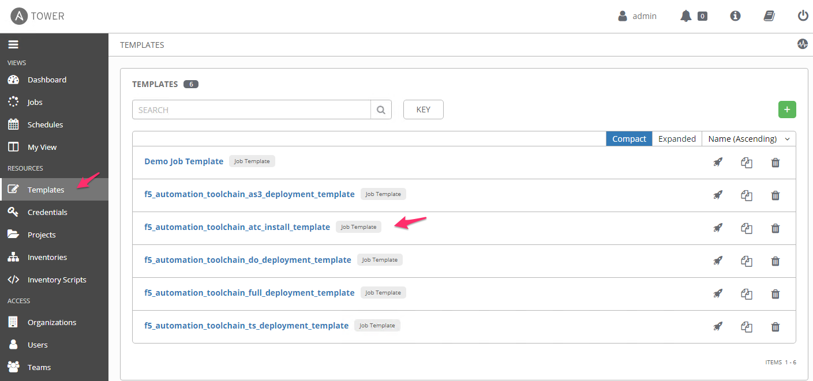
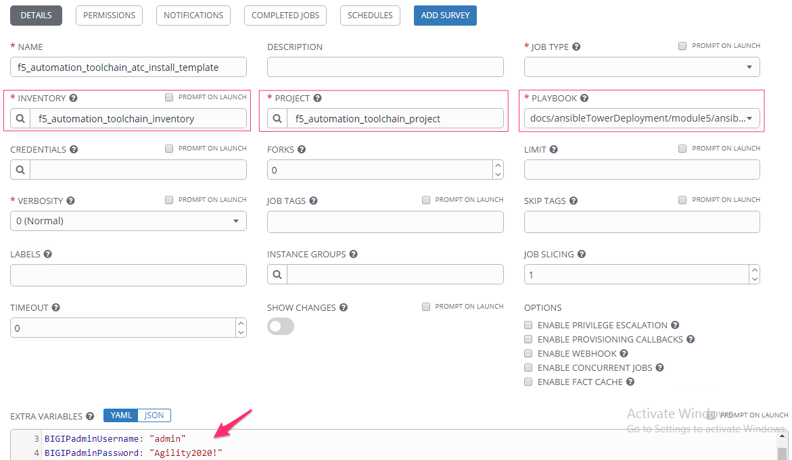
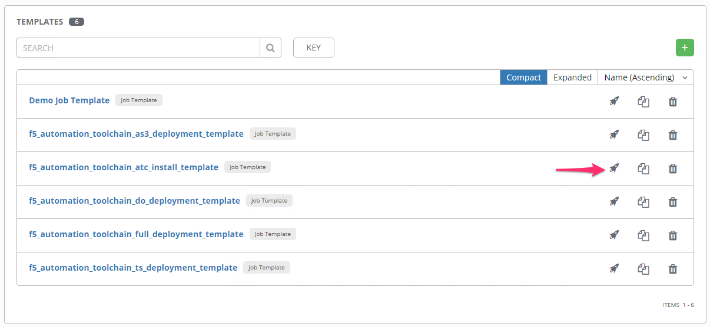
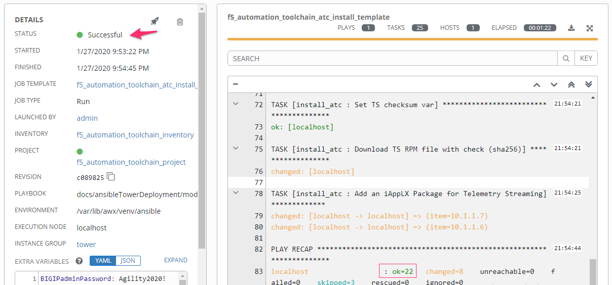

Module |labmodule|\, Lab \ |labnum|\: Automation Toolchain Template
===================================================================

Lab scenario:
~~~~~~~~~~~~~

The Automation Toolchain is an extension of the BIG-IP platform. It needs to be installed before it can be executed. This template will install the Automation Toolchain to a list of BIG-IPs contained in this lab. The underlying Ansible role as the ability to Pinto a specific version of the Toolchain or always installs the latest.

Task |labmodule|\.\ |labnum|\.1
~~~~~~~~~~~~~~~~~~~~~~~~~~~~~~~

Execute template in Tower to install the Automation Toolchain packages on the lab BIG-IPs.

Navigate to `Templates`.

  |image11|

This is our first template execution, the configuration for this template and all the others in this lab were create via our Postman call to Ansible Tower.

A Template contains a reference to an Ansible Playbook, which can be understood as a wrapper to a Playbook, which can then contain Tower objects, like centralized RBAC, localized Hosts, Variables and Self-Service portals.

  |image12|

Scroll to the bottom of our template and execute the `f5_automation_toolchain_atc_install_template`. This will start an Ansible Tower Job.

  |image13|

Reviewing the Playbook execution, we can see some testing and error handling that has been built into the tasks. The BIG-IP(s) are verified to be accessible, and Automation Toolchain was installed on both BIG-IP Units. 

  |image14|

Ansible literal configuration file for review:

.. literalinclude:: /class05/ansibleTowerDeployment/module5/ansible/roles/install_atc/tasks/main.yml
   :language: yaml

.. Warning:: If a template fails to be successful, re-execute the template. All of the objects in these Ansible tasks and F5 Automation Toolchain declarations are built for Idempotency and Atomic best practices. This means, a change is only executed if needed, and if a failure happens **all** changes revert.

.. |labmodule| replace:: 6
.. |labnum| replace:: 1
.. |labdot| replace:: |labmodule|\ .\ |labnum|
.. |labund| replace:: |labmodule|\ _\ |labnum|
.. |labname| replace:: Lab\ |labdot|
.. |labnameund| replace:: Lab\ |labund|

