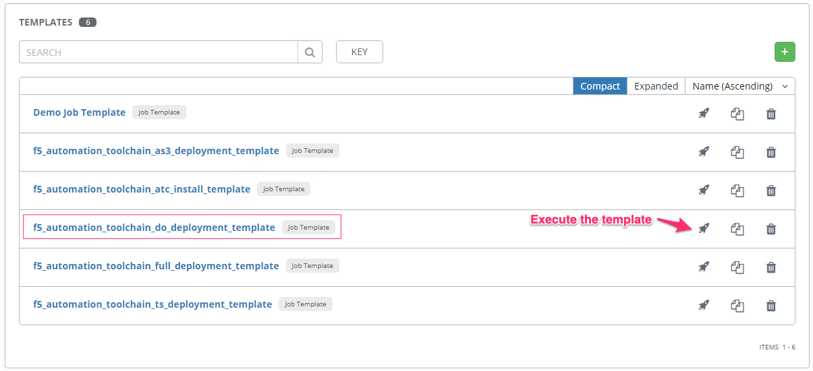
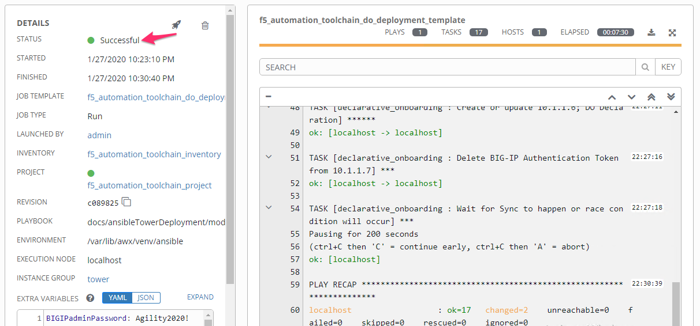
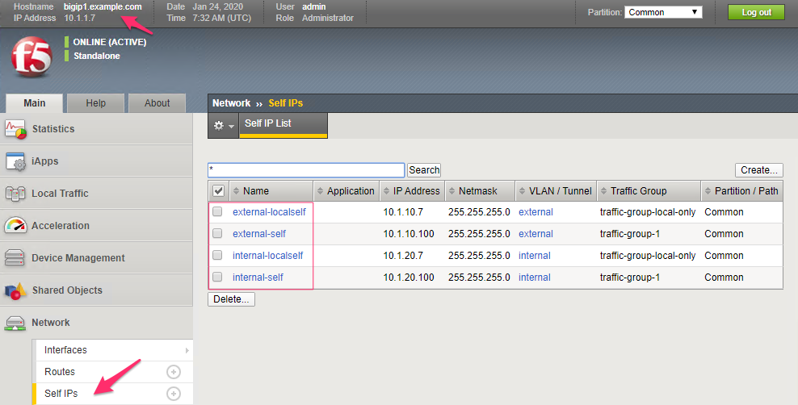

Module |labmodule|\, Lab \ |labnum|\: Declarative Onboarding Template
=====================================================================

Lab scenario:
~~~~~~~~~~~~~

F5 Declarative Onboarding (DO) uses a declarative_ model to initially configure a BIG-IP device with all of the required settings to get up and ready, this includes system settings such as licensing and provisioning, network settings such as VLANs and Self IPs, and clustering settings if you are using more than one BIG-IP system.

A declarative model means you provide a JSON declaration rather than a set of imperative commands. The declaration represents the configuration that Declarative Onboarding is responsible for creating on a BIG-IP system. You send a declaration file using a single Rest API call.

Declarative Onboarding can be used to onboard a BIG-IP; however, it can also be used for configuration adherence, making sure system settings like DNS, NTP, and user accounts state is always configured correctly.

This lab uses a Declarative Onboarding declaration to build out two BIG-IP clustered units.

Task |labmodule|\.\ |labnum|\.1
~~~~~~~~~~~~~~~~~~~~~~~~~~~~~~~

Execute template in Tower to utilize Declarative Onboarding against BIG-IPs.

Navigate to `Templates`.

  |image21|

Execute the `f5_automation_toolchain_do_deployment_template`.

The desired end state of these DO configurations is to configure the below objects, built on the BIG-IPs, with a single call in a single file. This declarative solution allows us to compose configurations that are reusable with templating technologies and storable in Source Control.

.. seealso:: This DO declaration was created from an F5 provided example located on CloudDocs DO_Example_

Configuration Items in our declaration:
  - Licensing
  - Credentials
  - Provisioning
  - DNS
  - NTP
  - Self-IPs
  - Vlans
  - Clustering

Ansible literal configuration file for review:

.. literalinclude:: /class05/ansibleTowerDeployment/module5/ansible/roles/declarative_onboarding/tasks/main.yml
   :language: yaml

Reviewing the Playbook execution, we can see some testing and error handling that has been built into the tasks. The BIG-IP(s) are verified to be accessible, and then Declarative Onboarding is verified installed and ready.

  |image22|

.. Note:: This template is executing against two BIG-IP units and takes longer than any of the other templates. There are a few pausing sections in the playbook to handle the clustering.

Using `Chrome` navigate to the ``Automation Toolch. . .`` bookmark folder and open a tab to each BIG-IP.

  - BIG-IP User: ``admin``
  - BIG-IP Password: ``Agility2020!``

After the configuration has been sent to our BIG-IP units, all DO objects should be complete and installed. At this point, we have a cluster of BIG-IP units ready to take on Service configuration.

  |image25|
  |image23|

.. |labmodule| replace:: 7
.. |labnum| replace:: 1
.. |labdot| replace:: |labmodule|\ .\ |labnum|
.. |labund| replace:: |labmodule|\ _\ |labnum|
.. |labname| replace:: Lab\ |labdot|
.. |labnameund| replace:: Lab\ |labund|

.. |image23| image:: images/image23.png

.. _declarative: https://www.f5.com/company/blog/in-container-land-declarative-configuration-is-king
.. _DO_Example: https://clouddocs.f5.com/products/extensions/f5-declarative-onboarding/latest/examples.html#example-2-clustered-declaration