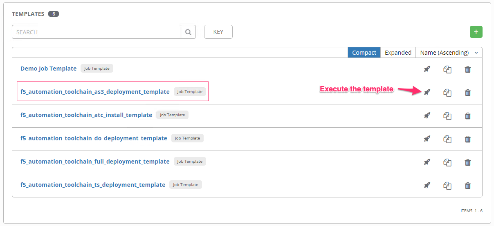
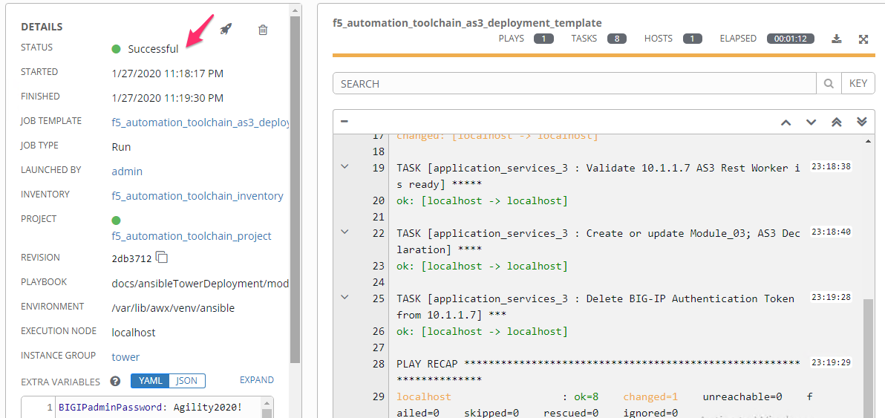
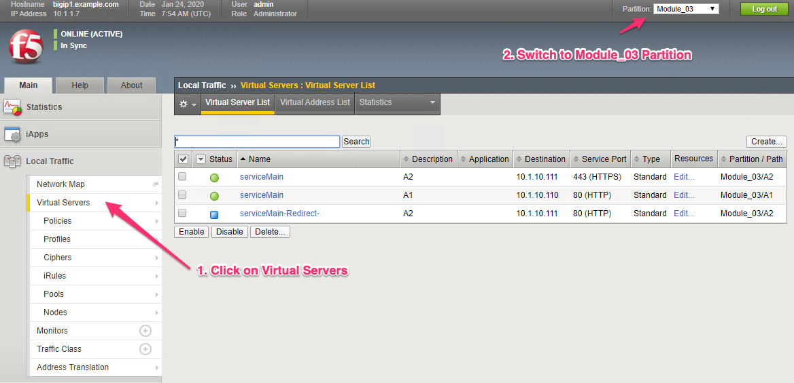

Module |labmodule|\, Lab \ |labnum|\: Application Services 3 Template
=====================================================================

Lab scenario:
~~~~~~~~~~~~~

Application Services 3 Extension (referred to as AS3 Extension or, more often merely AS3) is a flexible, low-overhead mechanism for managing application-specific configurations on a BIG-IP system. AS3 uses a declarative model, meaning you provide a JSON declaration rather than a set of imperative commands. The declaration represents the configuration which AS3 is responsible for creating on a BIG-IP system. AS3 is well-defined according to the rules of JSON Schema, and declarations validate according to JSON Schema. AS3 accepts declaration updates via REST (push), reference (pull), or CLI (flat-file editing).

This lab uses an Application Services 3 declaration to build out services on our BIG-IP Cluster.

Task |labmodule|\.\ |labnum|\.1
~~~~~~~~~~~~~~~~~~~~~~~~~~~~~~~

Execute template in Tower to utilize Application Services 3 against BIG-IPs.

Navigate to `Templates`.

  |image26|

Execute the `f5_automation_toolchain_as3_deployment_template`.

The desired end state of this AS3 configurations is to configure the below objects, built on the BIG-IPs, with a single call in a single file. This declarative solution allows us to compose configurations that are reusable with templating technologies and storable in source control.

.. seealso:: This AS3 declaration was based from F5 provided examples located on CloudDocs AS3_Example_

Configuration Items in our declaration:
  - Configuration Partition
  - Virtual Server x2
  - Pool with Service Discovery from HashiCorp Consul
  - TLS Certificate & Keys
  - Web Application Firewall Policy from ephemeral URI
  - Traffic Policy based on URI

Ansible literal configuration file for review:

.. literalinclude:: /class05/ansibleTowerDeployment/module5/ansible/roles/application_services_3/tasks/main.yml
   :language: yaml

Reviewing the Playbook execution, we can see some testing and error handling that has been built into the tasks. The BIG-IP(s) are verified to be accessible, and then Declarative Onboarding is verified installed and ready.

  |image27|

.. Note:: This template is executing against one BIG-IP because we have a cluster of units, the design of this template is to show the complexity that you can create with AS3, yet the simplicity of a single declarative declaration.

Using `Chrome` navigate to the ``Automation Toolch. . .`` bookmark folder and open a tab to each BIG-IP.

  - BIG-IP User: ``admin``
  - BIG-IP Password: ``Agility2020!``

After the configuration has been sent to our BIG-IP units, all AS3 objects should be complete and installed. At this point, we have a service that is available and ready on the BIG-IPs.

  |image28|

The Service can be viewed in Chrome from either from the IP address or the Bookmark in the Lab folder and selecting ``Module_03``

  |image29|

.. |labmodule| replace:: 8
.. |labnum| replace:: 1
.. |labdot| replace:: |labmodule|\ .\ |labnum|
.. |labund| replace:: |labmodule|\ _\ |labnum|
.. |labname| replace:: Lab\ |labdot|
.. |labnameund| replace:: Lab\ |labund|

.. |image29| image:: images/image29.png
   :width: 75%

.. _AS3_Example: https://clouddocs.f5.com/products/extensions/f5-appsvcs-extension/latest/declarations/http-services.html#http-and-https-virtual-services-in-one-declaration