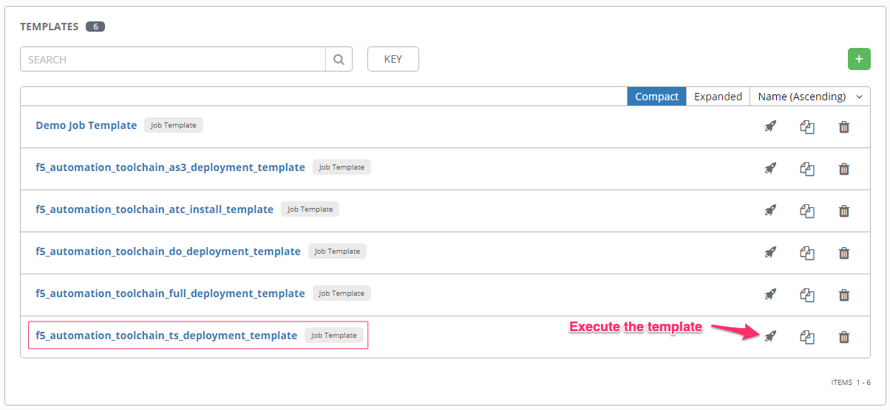
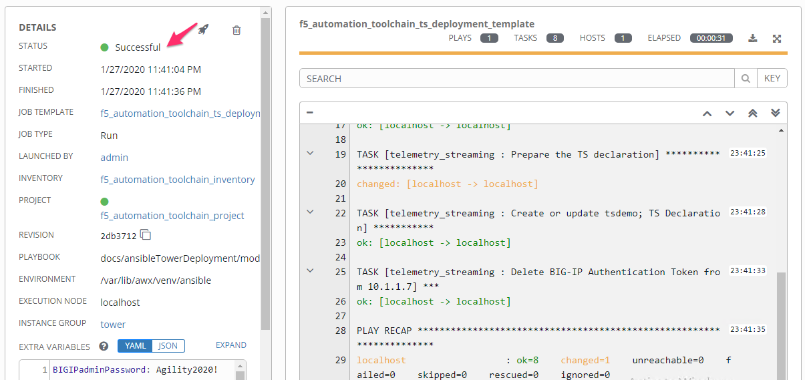
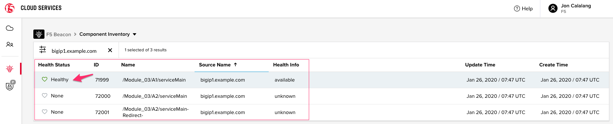

Module |labmodule|\, Lab \ |labnum|\: Telemetry Streaming Template
==================================================================

Lab scenario:
~~~~~~~~~~~~~

Telemetry Streaming (TS) is an iControl LX Extension delivered as a TMOS-independent RPM file. Installing the TS Extension on BIG-IP enables you to declaratively aggregate, normalize, and forward statistics and events from the BIG-IP to a consumer application by POSTing a single TS JSON declaration to the TS declarative REST API endpoint. The supported third-party consumers include:

  - Splunk
  - Azure Log Analytics
  - AWS CloudWatch
  - AWS S3
  - Graphite
  - Kafka
  - ElasticSearch
  - Sumo Logic
  - StatsD
  - Generic HTTP (Used for F5 Cloud Service Analytics `Beacon`)

This lab uses a TS declaration to build out our BIG-IP system forwarder.

Task |labmodule|\.\ |labnum|\.1
~~~~~~~~~~~~~~~~~~~~~~~~~~~~~~~

Execute template in Tower to utilize Telemetry Streaming against BIG-IPs.

Navigate to `Templates`.

  |image30|

Execute the `f5_automation_toolchain_ts_deployment_template`.

The desired end state of this TS configurations is to configure the below objects, built on the BIG-IPs, with a single call in a single file. TS similar to DO may not be a configuration that is altered very often, however having a defined single file setup can help unify system settings on multiple BIG-IPs.

.. seealso:: This TS declaration was created from an F5 provided example located on CloudDocs TS_Example_

Configuration Items in our declaration:
  - Poller
  - Consumer

Ansible literal configuration file for review:

.. literalinclude:: /class05/ansibleTowerDeployment/module5/ansible/roles/telemetry_streaming/tasks/main.yml
   :language: yaml

Reviewing the Playbook execution, we can see some testing and error handling that has been built into the tasks. The BIG-IP(s) are verified to be accessible, and then Declarative Onboarding is verified installed and ready. 

  |image31|

.. Warning:: This template is executing against BIG-IP01. This is to allow one BIG-IP per student in F5s cloud service Beacon. In a typical environment, you would want analytics and telemetry data from all sources.

.. Note:: TS consumer with Beacon_ was chosen as an example to highlight the F5 Cloud Service and rapid deployment.

There is no configuration within the BIG-IP TMUI to show. The TS declaration utilizes an API token to allow the BIG-IP to self-register with F5 Cloud Service Beacon. The TS **Poller** polls the BIG-IP for tmstat information, and harvests the names of all service level objects (VIPs, Pools, iRules, etc.) and sends it out to Beacon.

  |image32|

.. Warning:: This concludes the Ansible Tower Deployment Option of this lab, lab complete!

.. |labmodule| replace:: 9
.. |labnum| replace:: 1
.. |labdot| replace:: |labmodule|\ .\ |labnum|
.. |labund| replace:: |labmodule|\ _\ |labnum|
.. |labname| replace:: Lab\ |labdot|
.. |labnameund| replace:: Lab\ |labund|

.. _TS_Example: https://clouddocs.f5.com/products/extensions/f5-telemetry-streaming/latest/setting-up-consumer.html#generic-http
.. _Beacon: https://www.f5.com/products/beacon-visibility-and-analytics