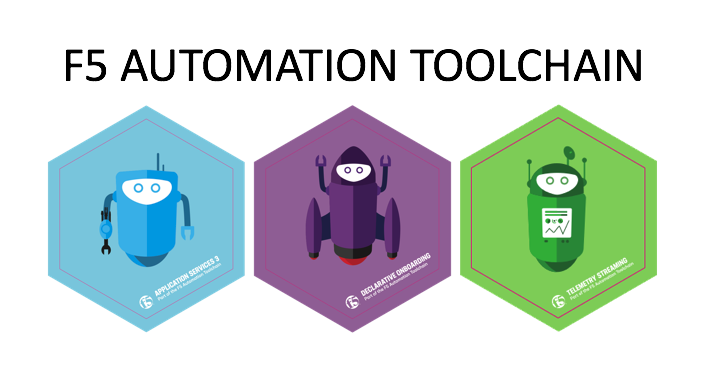

Lab Information
===============

Access into the lab environment and all work will be performed through the **Win 10 Jumphost**.

.. Warning:: You need to have outbound access from your system, allowing Microsoft Remote Desktop Protocol.

Lab Topology
------------

- 1 x Windows Jumphost
- 1 x Ansible Tower
- 1 x Docker Host
    - Docker
        - NGiNX
        - Juice Shop
        - Hashicorp Consul
        - GitLab
- 2 x BIG-IP
- 1 x BIG-IQ Centralized Manager

Network Addressing
------------------

The following table lists VLANS, IP Addresses, and Credentials for all
components:

.. list-table:: Lab Components
   :widths: 15 30 30 30
   :header-rows: 1
   :stub-columns: 1

   * - **Component**
     - **Management IP**
     - **VLAN/IP Address(es)**
     - **Credentials**

   * - Win 7 Jumphost
     - 10.1.1.10
     - **External:** 10.1.10.10
     - student/automation

   * - Docker Host
     - 10.1.1.11
     - **External:** 10.1.10.11
       **Internal:** 10.1.20.11
     - mTLS

   * - Ansible Tower
     - 10.1.1.8
     - **External:** 10.1.10.12
       **Internal:** NA
     - admin/Agility2020!

   * - BIGIQ v7.0 CM
     - 10.1.1.4
     - **External:** 10.1.10.4
       **Internal:** 10.1.20.4
     - admin/MasterPassphrase123!

   * - BIGIP01 v14.1.0.3-0.0.6
     - 10.1.1.7
     - **External:** 10.1.10.7
       **Internal:** 10.1.20.7
       **External Float** 10.1.10.100
       **Internal Float** 10.1.20.100
     - admin/Agility2020!
       root/Agility2020!

   * - BIGIP02 v14.1.0.3-0.0.6
     - 10.1.1.6
     - **External:** 10.1.10.6
       **Internal:** 10.1.20.6
       **External Float** 10.1.10.100
       **Internal Float** 10.1.20.100
     - admin/Agility2020!
       root/Agility2020!

.. Note:: For Postman to store objects dynamically f5-postman-workflows_ have been installed on the jumphost, this is an extension to Postman utilizing `Tests` objects.

.. Note:: The Automation Toolchain packages have been downloaded and stored in the jump host. This is done to reduce the time to deployment.

.. |labmodule| replace:: labinfo
.. |labnum| replace:: 1
.. |labdot| replace:: |labmodule|\ .\ |labnum|
.. |labund| replace:: |labmodule|\ _\ |labnum|
.. |labname| replace:: Lab\ |labdot|
.. |labnameund| replace:: Lab\ |labund|

.. _f5-postman-workflows: https://github.com/0xHiteshPatel/f5-postman-workflows
