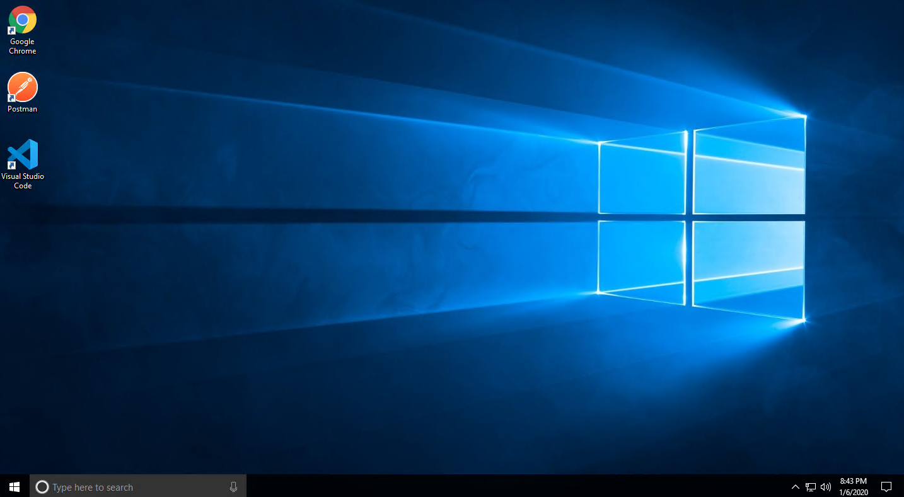
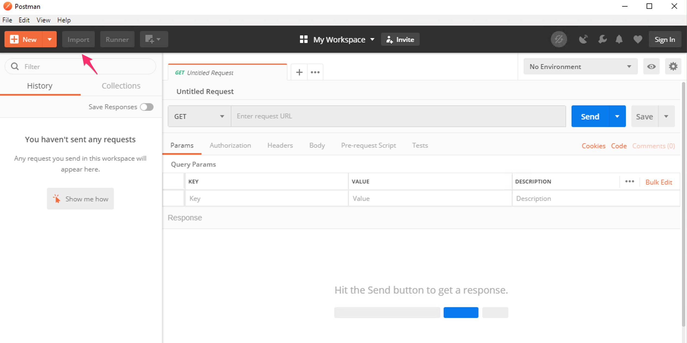
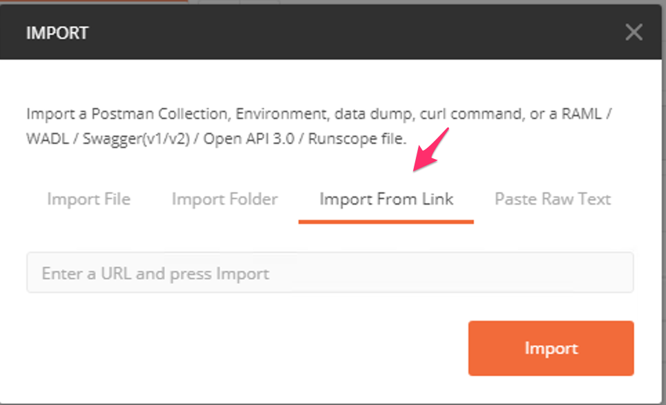
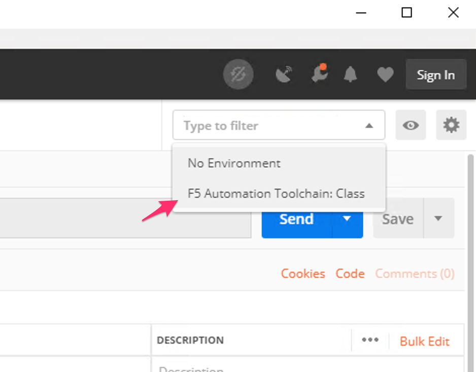
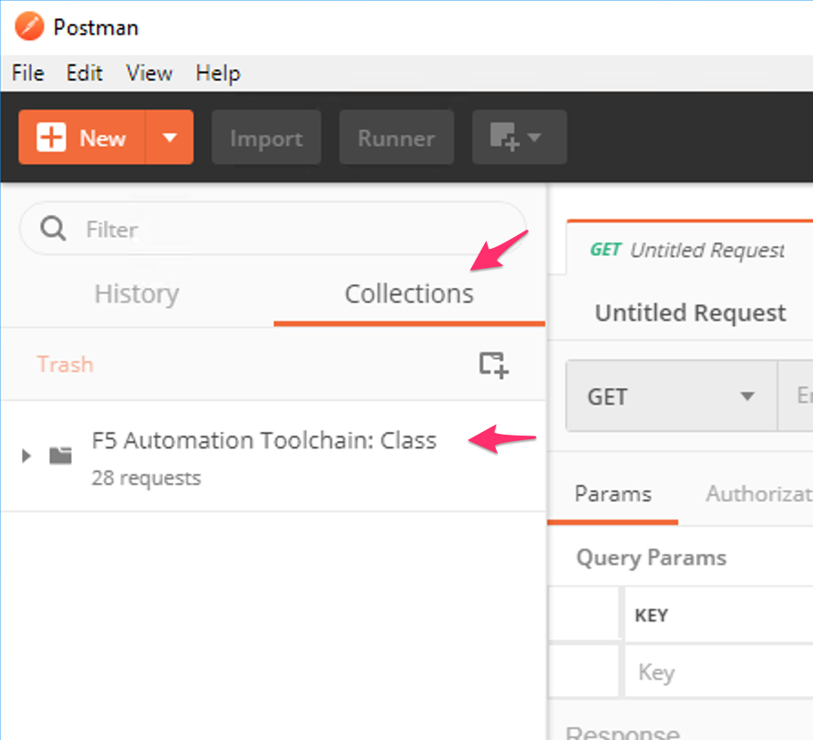
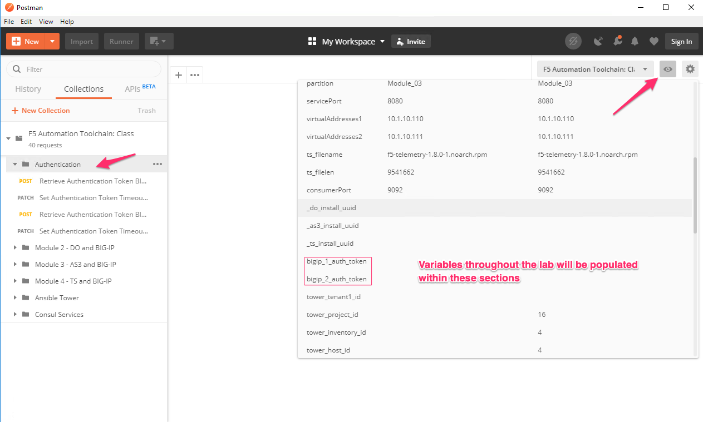
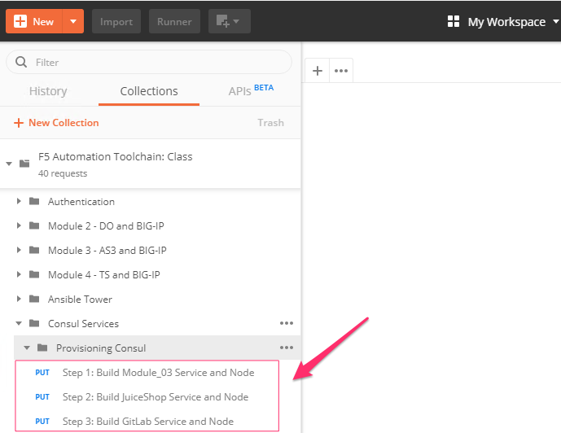
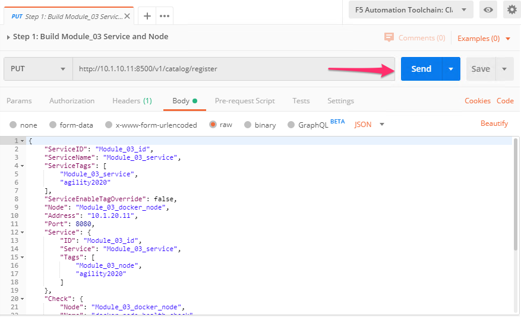
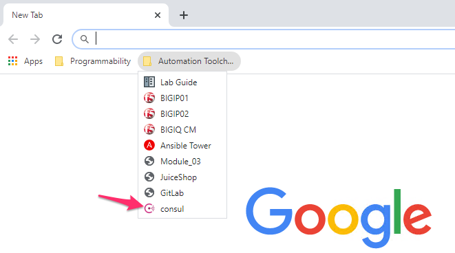
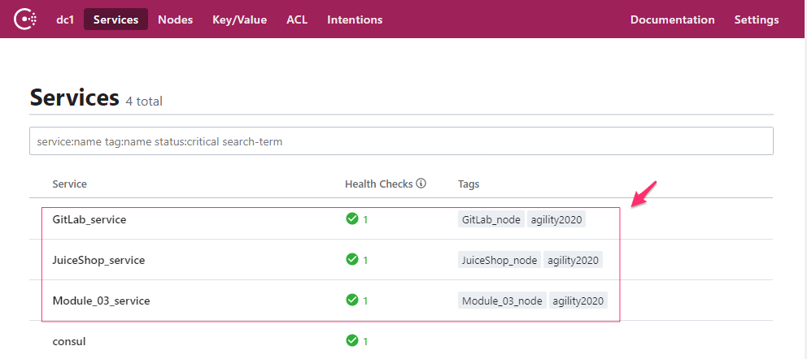

Module 1: Priming the Environment
=================================

|image1|

**Environmental Configuration**

Lab Setup:
----------

Our lab environment utilizes a jump host with Postman for the Modules. In the steps below, we set up the environment for the lab.

Task |labmodule|\.\ |labnum|\.1
-------------------------------

.. NOTE:: You should have received all your student info to access the lab. If you have not, please find an instructor.

Begin by connecting to your lab environment portal. From the portal, you have a view of the components within the lab.

From the portal, find your `Win 10 Jumphost`, open using the RDP Access method.

.. Warning:: You need to have Microsoft RDP protocol and application allowed to be executed to access external resources. RDP can be blocked with always-on VPN services or firewalls.

Credentials for the `Win 10 Jumphost`:

- Username: ``student``
- Password: ``automation``

Task |labmodule|\.\ |labnum|\.2
-------------------------------

Please familiarize yourself with the Remote Desktop, in this module we are going to be using a few tools provided in the jump host.

  |image2|

The following tools are used in this lab:

- vscode_ as our code editor / validator
- Postman_ as our API interaction tool
- Chrome_ as our browser

Task |labmodule|\.\ |labnum|\.3
-------------------------------

Open up Postman and import the collection needed for this lab. This collection configuration is used for this module and modules to follow.

  |image3|

Choose `Import from Link`:

  |image4|

Copy the collection path and import into Postman:

``https://raw.githubusercontent.com/f5devcentral/f5-agility-labs-automation/master/docs/class05/files/postman_collections/F5%20Automation%20Toolchain-%20Class.postman_collection.json``

Task |labmodule|\.\ |labnum|\.4
-------------------------------

Open up Postman and import the environment needed for this lab. This environment configuration is used for this module and modules to follow.

  |image3|

Choose `Import from Link`:

  |image4|

Copy the environment path and import into Postman:

``https://raw.githubusercontent.com/f5devcentral/f5-agility-labs-automation/master/docs/class05/files/postman_collections/F5%20Automation%20Toolchain-%20Class.postman_environment.json``

Task |labmodule|\.\ |labnum|\.5
-------------------------------

**Verify and set** both the collection and the environment previously imported into Postman in steps 2.3 and 2.4.

Environment:
  |image5|

Collection:
  |image6|

Task |labmodule|\.\ |labnum|\.6
-------------------------------

We are going to set some authentication tokens for use throughout this lab.

.. Note:: F5 BIG-IP authentication token last a maximum of 10 hours

Expand the `Authentication` tab within the collection and run (**SEND**) for **all** of the steps in order. This section, requests, extends, and stores our tokens in Postman environment variables to be used.

  |image7|

Task |labmodule|\.\ |labnum|\.7
-------------------------------

This lab heavily utilizes Service Discovery, which handles populating the BIG-IP pool members from an ephemeral resource (HashiCorp Consul). For our BIG-IP services to be alive and pass traffic, we need to build the Services and Nodes in Consul.

HashiCorp Consul is already running within the environment. However, we want to highlight the configuration of Consul to highlight the Role responsibility alignment. Utilizing an ephemeral resource on the BIG-IP allows for better delegation of Roles within an organization.

Return to Postman and navigate into the ``Consul Services`` > ``Provisioning Consul``.

  |image8|

Start with `Step 1:` and execute each of the three REST requests to the Consul API.

  |image9|

Once you have executed all of the requests, you can validate the configuration is in the Consul UI. From the Chrome browser, open the bookmarks folder for this lab and open the Consul bookmark.

  |image10|

We just registered 3 Services and Nodes into Consul, which were also configured for health checks that Consul performs, all units should show `Green` and alive.

  |image11|

.. Note:: We utilized the direct API for Consul to create these objects. This only highlights one option for the Consul registration process; in most environments, devices will self-register with a Consul agent installed. This agent keeps track of the Service it should register into, and as new Nodes come in and out of the Service, Consul keeps the correct state. The BIG-IP via AS3 will check the state of a Service or a Node in Consul to create/update/delete its pool members.

Your environment is now ready to be utilized.

.. |labmodule| replace:: labinfo
.. |labnum| replace:: 2
.. |labdot| replace:: |labmodule|\ .\ |labnum|
.. |labund| replace:: |labmodule|\ _\ |labnum|
.. |labname| replace:: Lab\ |labdot|
.. |labnameund| replace:: Lab\ |labund|

.. |image1| image:: images/image1.png
   :width: 200px

.. _vscode: https://code.visualstudio.com/
.. _Postman: https://www.getpostman.com
.. _Chrome: https://www.google.com/chrome/
