Module |labmodule|\, Lab \ |labnum|\: F5 Declarative Onboarding
===============================================================

|image1| **Declarative Onboarding**

Introduction:
~~~~~~~~~~~~~

F5 Declarative Onboarding (DO) uses a declarative_ model to initially configure a BIG-IP device with all of the required settings to get up and ready, this includes system settings such as licensing and provisioning, network settings such as VLANs and Self IPs, and clustering settings if you are using more than one BIG-IP system.

A declarative model means you provide a JSON declaration rather than a set of imperative commands. The declaration represents the configuration that Declarative Onboarding is responsible for creating on a BIG-IP system. You send a declaration file using a single Rest API call.

Declarative Onboarding can be used to onboard a BIG-IP; however, it can also be used for configuration adherence, making sure system settings like DNS, NTP, and user accounts state is always configured correctly.

This lab uses a Declarative Onboarding declaration to build out two BIG-IP clustered units.

.. seealso:: DO CloudDocs_ Page.

Task |labmodule|\.\ |labnum|\.1
~~~~~~~~~~~~~~~~~~~~~~~~~~~~~~~

Using `Chrome` open the bookmark folder `Automation Toolch.` then open tabs to each BIG-IP system, they are currently in a default configuration (No Configuration). These units have a management IP address and are sitting at the Setup Utility ready to accept the configuration.

.. Note:: This would be the configuration of a new BIG-IP (Virtual or Hardware).

BIGIP01 and BIGIP02:
- Username: ``admin``
- Password: ``Agility2020!``

  |image8|

Leave the tabs open in Chrome for later.

Task |labmodule|\.\ |labnum|\.2
~~~~~~~~~~~~~~~~~~~~~~~~~~~~~~~

F5 Declarative Onboarding is an iControlLX_ package, which needs to be installed on the BIG-IP or API Services Gateway before use. After DO is installed, we interact with it through a REST verb to configure our BIG-IP(s).

.. seealso:: The iControl LX extension allows you to use Node.js to extend the REST API on any BIG-IP. You can write an iControl LX extension to implement your REST API using JavaScript to represent the URI resources (nouns) that you can then invoke in a RESTful manner. The REST verb handlers can then perform appropriate actions local to the F5 devices or across the distributed data center. An iControl LX extension is an extensibility point attached to a specific URI, enabling customer-provided JavaScript/Node.js code to run in the context of the BIG-IP/iWorkflow control plane extending the REST API with additional services. You can extend existing F5 REST APIs as well as convert your services into multiple extensions that run on the F5s control plane.

Expand the `Module 2 - DO and BIG-IP` tab within the collection and execute `Step 1: Get Installed iControl LX Extensions BIGIP1`. This step requests the iControlLX packages already installed on the BIG-IP.

  |image10|

The response of the currently installed packages:

  |image11|

Task |labmodule|\.\ |labnum|\.3
~~~~~~~~~~~~~~~~~~~~~~~~~~~~~~~

An iControlLX package can be installed via the BIG-IP API, or through the TMUI, we are going to install this through the API with `Step 2: Upload DO Extension RPM BIGIP1`.

Installing the rpm package through the API with Postman requires a few variables in the collection which have already been set on your behalf (size of package and name). However, you need to select the package to be installed, these have been downloaded for you and are in the `Downloads` folder of your jump host.

Select the Declarative Onboarding rpm file for this Step

  |image13|

Execute the step to upload the package to the BIG-IP

  |image14|

Task |labmodule|\.\ |labnum|\.4
~~~~~~~~~~~~~~~~~~~~~~~~~~~~~~~

Once the rpm package is installed on the BIGIP1, we need to tell the BIG-IP to install the package so we can make use of it.

Execute the following steps viewing the response pages and the status of installing the DO package.

Step 3: Create DO Extension Install Task BIGIP1:

  |image15|

Step 4: Get DO Install Task Status BIGIP1:

  |image16|

Step 5: Check DO Installed BIGIP1:

  |image17|

.. Note:: Declarative Onboarding installed and ready with no configuration shows an empty response, like the picture above.

Task |labmodule|\.\ |labnum|\.5
~~~~~~~~~~~~~~~~~~~~~~~~~~~~~~~

With the DO package installed on the BIGIP1, we are ready to build out our first BIG-IP.

The desired end state of these DO configurations is to configure the below objects, built on the BIG-IPs, with a single call in a single file. This declarative solution allows us to compose configurations that are reusable with templating technologies and storable in Source Control.

.. seealso:: This DO declaration was created from an F5 provided example located on CloudDocs DO_Example_.

Configuration Items in our declaration:
  - Licensing
  - Credentials
  - Provisioning
  - DNS
  - NTP
  - Self-IPs
  - Vlans
  - Clustering

Declaration for BIGIP1:

Copy **all of** the below DO declaration.

.. literalinclude :: /class05/ansibleTowerDeployment/module5/ansible/roles/declarative_onboarding/files/do_cluster_bigip1.json
   :language: json

Task |labmodule|\.\ |labnum|\.6
~~~~~~~~~~~~~~~~~~~~~~~~~~~~~~~

F5 publishes a schema for each of the Automation Toolchain items. This published schema can be used in Visual Studio Code, allowing you to see context and find errors within your different declarations. The schema reference is added at the top of your declaration, and requires vscode to know the language is JSON.

.. seealso:: Schema Validation for Declarative Onboarding (DO_Schema_).

Open `Visual Studio Code` on your jump host desktop and open a `New File` (shortcut Ctrl+n) and paste in all of the DO declaration contents, then set the language to `json`.

  |image18|

Once the declaration and language are set, you can highlight over sections of the code to see context and errors.

  |image19|

.. note:: You can try misspelling some of the declaration objects to see errors, remember to revert your changes.

Task |labmodule|\.\ |labnum|\.7
~~~~~~~~~~~~~~~~~~~~~~~~~~~~~~~

We now need to send our declaration to BIGIP1; this is the first member of our cluster, and the one our second BIG-IP pulls its configuration.

Click on step `Step 6: DO Declaration BIGIP1`, navigate to the `Body` tab and paste in all of your declarations, and send the call.

  |image20|

.. note:: You can leave the schema validation line, the BIG-IP ignores it.

The declaration is now on BIGIP1 being processed; this takes a few seconds to process and build out our objects.

Task |labmodule|\.\ |labnum|\.8
~~~~~~~~~~~~~~~~~~~~~~~~~~~~~~~

Return to your BIGIP1 TMUI in Chrome; you can now navigate around the UI and see the objects created from the declaration.

  |image21|

Task |labmodule|\.\ |labnum|\.9
~~~~~~~~~~~~~~~~~~~~~~~~~~~~~~~

Building out BIGIP2 is going to be similar. However, the declaration is slightly different; BIGIP1 and BIGIP2 have some device-specific items, like Self-IPs. These small differences are prime examples of solutions that templatize exceptionally well. We could have used Parameters in Postman or other templating tools that an Orchestrator may provide (like Jinja2 in Ansible).

.. Note:: iControlLX packages are device configuration objects that sync across clustered BIG-IP, however since we are creating our cluster with DO, we need to install it on BIGIP2 as well.

Progress through **Module 2 Postman Steps 7-11**, remember to select your file for the upload step.

Declaration for BIGIP2:

Copy **all of** the below DO declaration.

.. literalinclude :: /class05/ansibleTowerDeployment/module5/ansible/roles/declarative_onboarding/files/do_cluster_bigip2.json
   :language: json

Task |labmodule|\.\ |labnum|\.10
~~~~~~~~~~~~~~~~~~~~~~~~~~~~~~~~

The last step of Module 2 is to place our declaration on BIGIP2. This declaration provides the needed pieces to create our cluster.

  |image22|

.. Warning:: Clustering can take several minutes to sync and establish, this is normal.

Return to either BIG-IP TMUI in Chrome and check the cluster configuration and status. Both units are clustered with all onboarding objects, defined from the declaration.

  |image23|

.. warning:: You may need to refresh the BIG-IP TMUI to see the changes.

This concludes Module 2 and onboarding your BIG-IP with F5 Declarative Onboarding.

.. |labmodule| replace:: 2
.. |labnum| replace:: 1
.. |labdot| replace:: |labmodule|\ .\ |labnum|
.. |labund| replace:: |labmodule|\ _\ |labnum|
.. |labname| replace:: Lab\ |labdot|
.. |labnameund| replace:: Lab\ |labund|

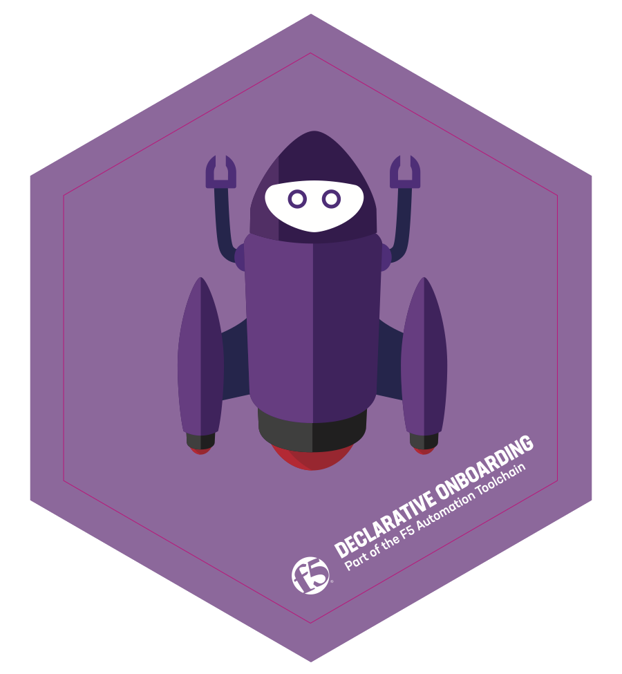
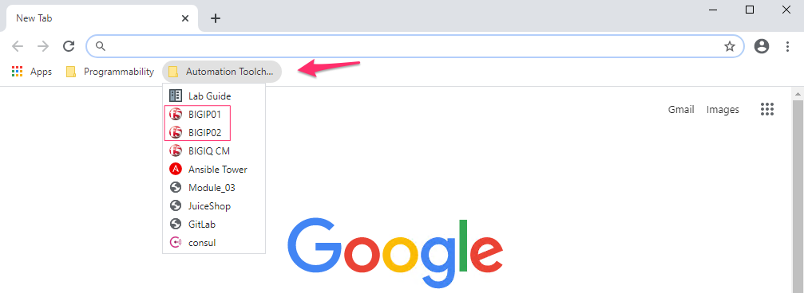
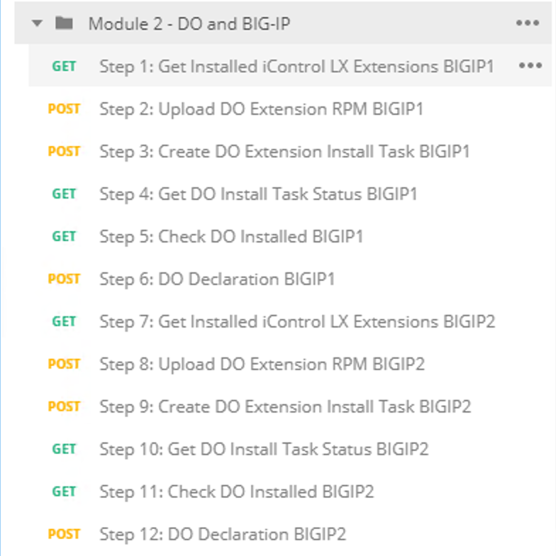

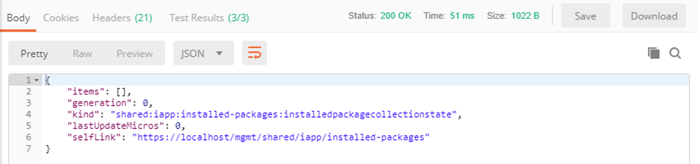

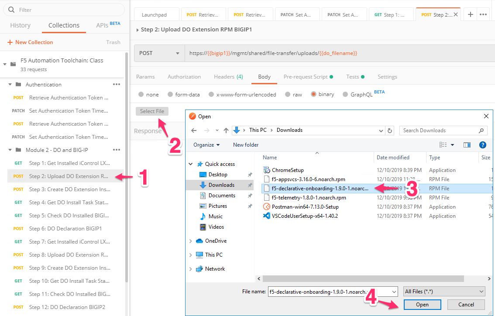
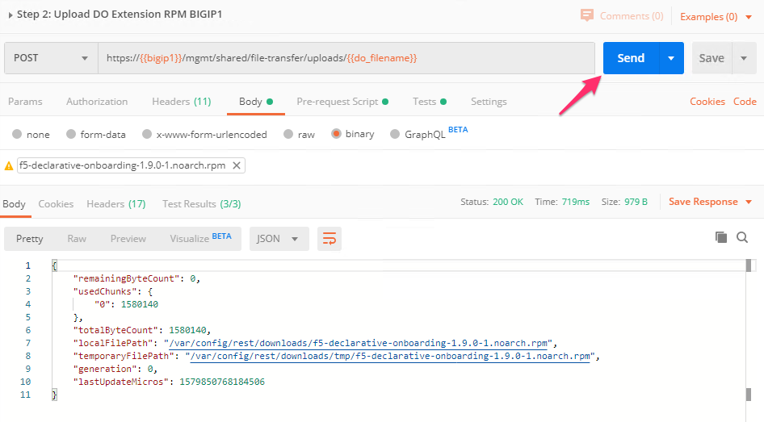
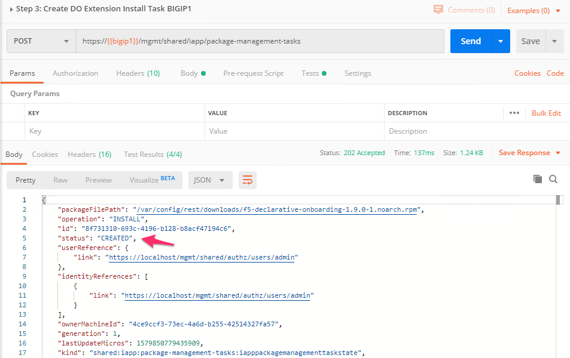
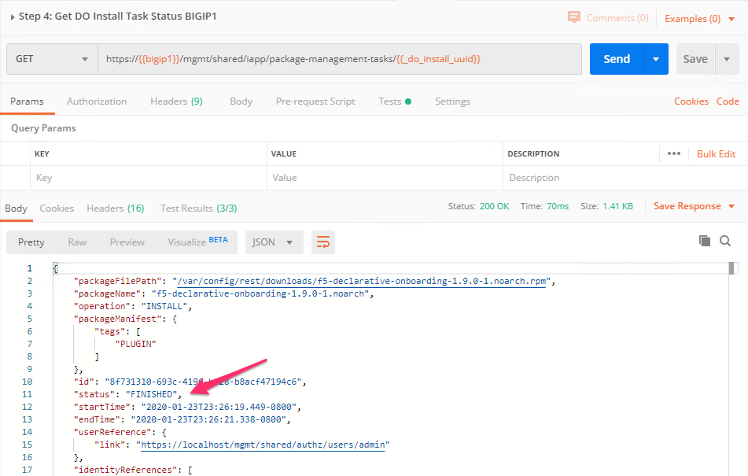
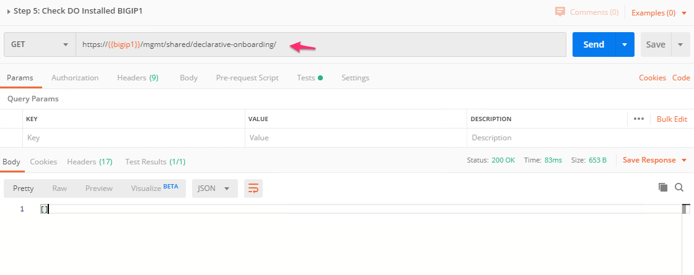
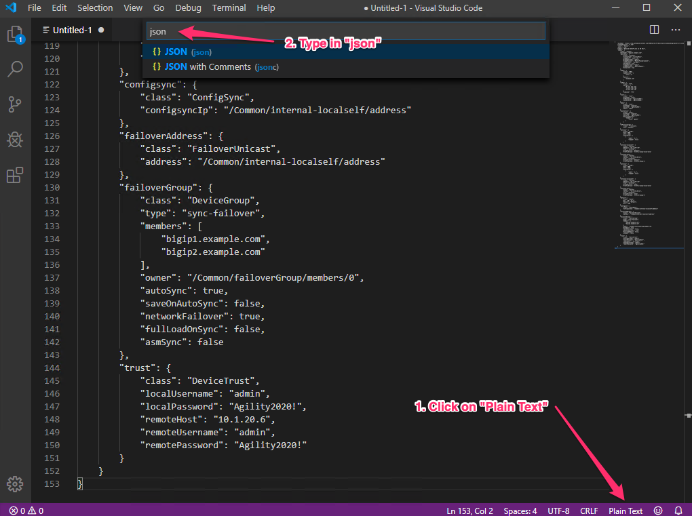
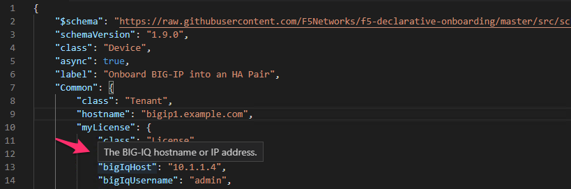
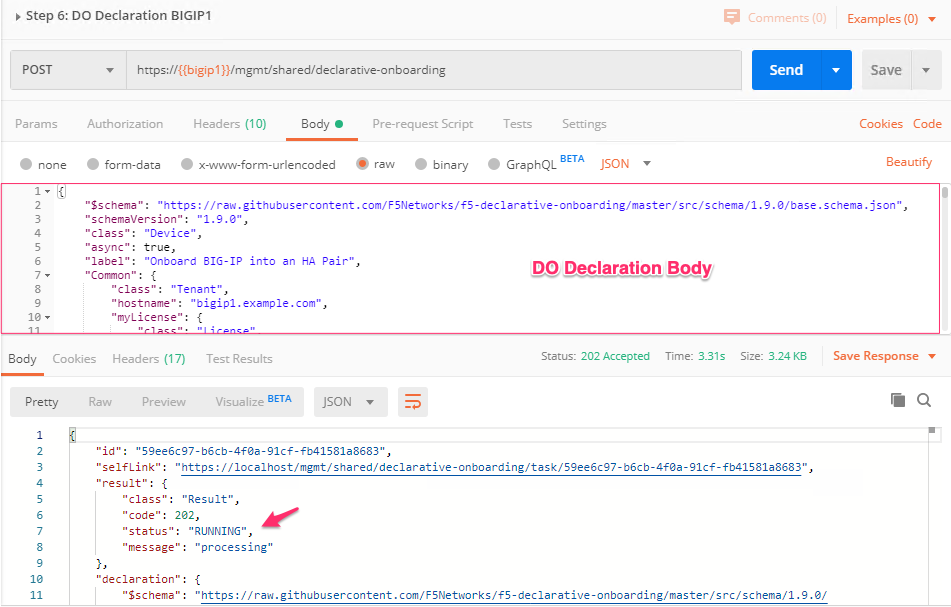
.. |image21| image:: images/image21.png
   :width: 75%
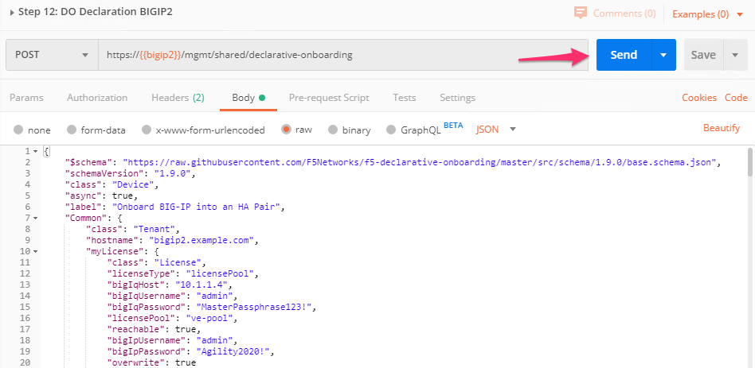
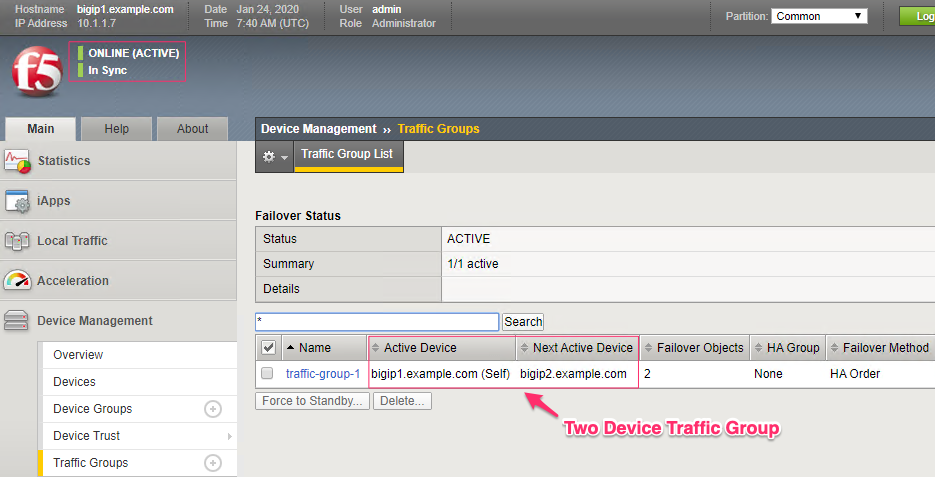

.. _AS3: https://clouddocs.f5.com/products/extensions/f5-appsvcs-extension/latest/
.. _declarative: https://www.f5.com/company/blog/in-container-land-declarative-configuration-is-king
.. _iControlLX: https://clouddocs.f5.com/products/iapp/iapp-lx/tmos-13_1/icontrollx_concepts/icontrollx-overview.html
.. _CloudDocs: https://clouddocs.f5.com/products/extensions/f5-declarative-onboarding/latest/
.. _DO_Schema: https://clouddocs.f5.com/products/extensions/f5-declarative-onboarding/latest/validate.html
.. _DO_Example: https://clouddocs.f5.com/products/extensions/f5-declarative-onboarding/latest/examples.html#example-2-clustered-declaration
