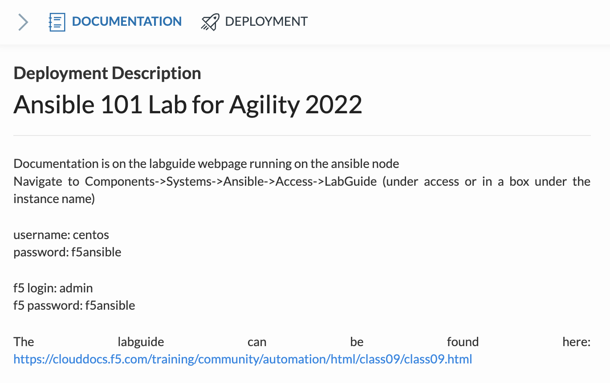
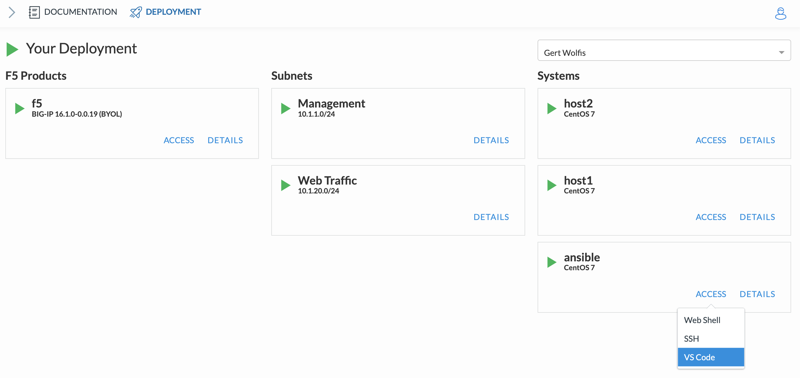
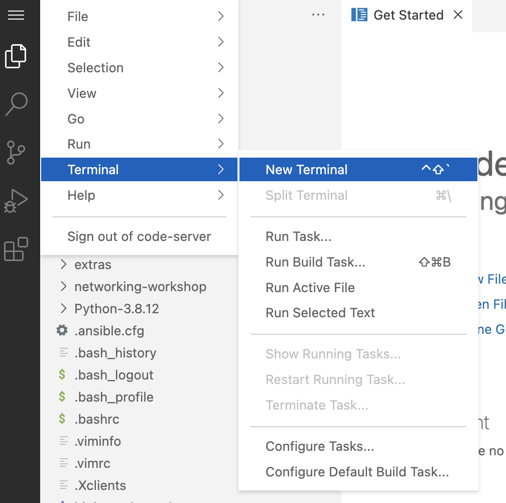
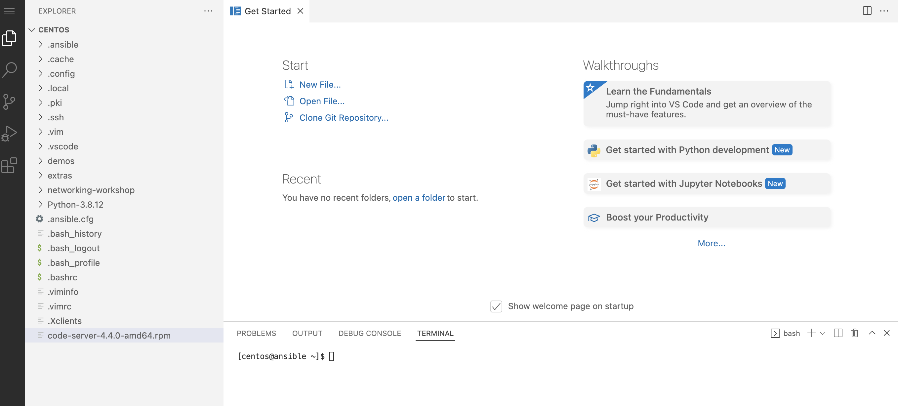
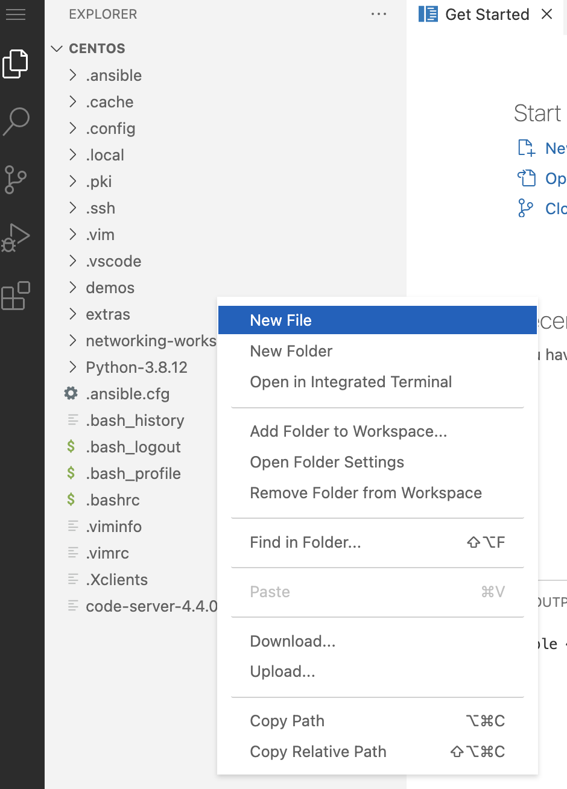

.. _0.0-getting-started:

Exercise 0.0: Getting Started
###########################################

During this lab Visual Studio Code will be used as the editor of choice and also provides a terminal to run Ansible playbooks and watch the logging accordingly.

Follow the steps below to start using VS Code in local browser as part of this lab.

Step 1
------

If you already haven't done so. Use the UDF deployment to go to the **Documentation** section and grab the lab guide: https://clouddocs.f5.com/training/community/automation/html/class09/class09.html |labguide|

Step 2
------

In the UDF deployment, go to the **Deployment** section, search the **Ansible host** and click **Access** and select **VS Code**. |vscode_access|

Your local browser will start up VS Code.

Step 3
------

If you want to you can select a theme or keep the default by clicking **Mark Done** and select **Yes, I trust...**. Ignore the pop-up windows in the bottom-right of your browser by **closing** them.

Step 4
------

Go to the left side of the screen and select the **three stripes**, go to **Terminal** and select **New Terminal**. |terminal|

The **Terminal Pane** section will appear at the bottom and change the view from **Output** to **Terminal**. |vscode_pane|

You can use the **terminal Pane** to launch **Ansible playbooks** and execute **Shell** commands during the lab.

Step 5
------
In order to be able to deploy those Ansible playbooks, you need to create YAML scripts which will become your ansible-playbooks.
In **Explorer right-click** and select **New File**. |new_file|

..

   Make sure you right-click in the 'empty' grey area. When you right-click at the height of the folder section and create anew file, that file will end up in that selected directory.

You finished the **Getting Started** section. `Click here to return to the labguide <..>`__