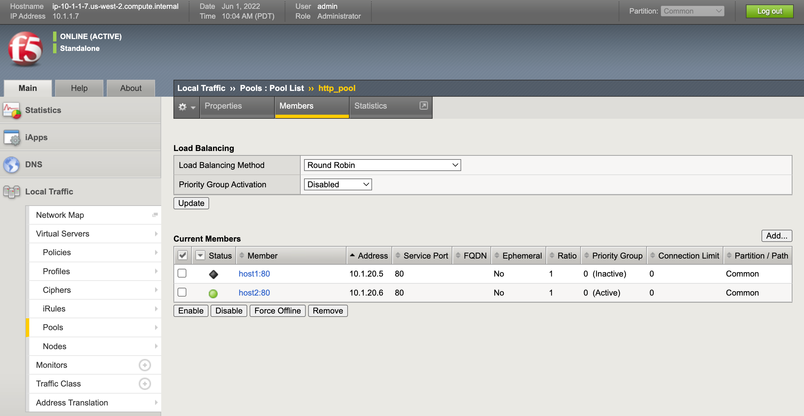

.. _2.0-disable-pool-members:

Exercise 2.0: Disabling a pool member
######################################

Objective
=========

This time we are going to disable a pool member from the pool. 
The build syntax will demonstrate the removal of a node 
from the pool.

Build a Playbook that:

-  Retrieve Facts from BIG-IP for the pools present on the BIG-IP (in our
   example only one pool is present) 
-  Display pools available
-  Store the pool name as a fact
-  Display all the pool members that belong to the
   pool
-  Prompt the user to disable a particular member or disable all members of the pool 
-  Force the appropriate pool members offline

Guide
=====

Step 1:
-------

Using your text editor of choice create a new file called
``disable-pool-member.yml``.

.. code-block:: shell-session

   [centos@ansible ~]$ nano disable-pool-member.yml

..

   ``vim`` and ``nano`` are available on the control node. 
   The Ansible node is equiped with ``Visual Studio Code`` and can be accessed via UDF ACCESS Methods.

Step 2:
-------

Enter the following play definition into ``disable-pool-member.yml``:

.. code-block:: yaml

   ---
   - name: "Disabling a pool member"
     hosts: lb
     gather_facts: false
     connection: local

Step 3
------

Add a tasks section and then set a fact for the provider. Once you set
the provider you can re-use this key in future tasks instead of giving
the server/user/password/server_port and validate_certs info to each
task.

.. code-block:: yaml

     tasks:
     
     - name: Setup provider
       set_fact:
        provider:
         server: "{{private_ip}}"
         user: "{{ansible_user}}"
         password: "{{ansible_ssh_pass}}"
         server_port: "8443"
         validate_certs: "no"

Step 4
------
Next, add a task to Retrieve Facts from BIG-IP for the subset ``ltm-pools``

.. code-block:: yaml

   - name: Query BIG-IP facts
    bigip_device_info:
      provider: "{{provider}}"
      gather_subset:
        - ltm-pools
    register: bigip_facts

You DO NOT need to pass the server_ip/user/password etc. for each module
going forward.

Step 5
------

Deploy ``ansible-playbook disable-pool-members.yml -vvvv`` and watch the outcome.

The ``-vvvv`` creates extra verbose and makes that you sew more output when the ansible playbook gets deployed

Step 6
------

Next, add a task to Display the pool information to the terminal window

.. code-block:: yaml

  - name: Display Pools available
    debug: "msg={{item.name}}"
    loop: "{{bigip_facts.ltm_pools}}"
    loop_control:
      label: "{{item.name}}"

Repeat Step 5 by deploying the Ansible playbook.

Step 7
------

Next, add a task to Store the pool name as a fact

.. code-block:: yaml

  - name: Store pool name in a variable
    set_fact:
      pool_name: "{{item.name}}"
    loop: "{{bigip_facts.ltm_pools}}"
    no_log: true

Repeat Step 5 by deploying the Ansible playbook.

Step 8
------

Next, add a task to Display members belonging to the pool

.. code-block:: yaml

  - name: "Show members belonging to pool {{pool_name}}"
    debug: "msg={{item}}"
    loop: "{{bigip_facts.ltm_pools | json_query(query_string)}}"
    vars:
      query_string: "[?name=='{{pool_name}}'].members[*].name[]"

Step 9
------

Next, add a task which will ask the user to enter one of two options:

-  a Host:Port to disable a particular member
-  ‘all’ to disable all members

.. code-block:: yaml

  - pause:
      prompt: "To disable a particular member enter member with format member_name:port \nTo disable all members of the pool enter 'all'"
    register: member_name

Step 10
------

Next, add a task which will Read the prompt information and disable all members or a single member based on the input from the user

.. code-block:: yaml

  - name: Disable ALL pool members
    bigip_pool_member:
      provider: "{{provider}}"
      state: "forced_offline"
      name: "{{item.split(':')[0]}}"
      pool: "{{pool_name}}"
      port: "{{item.split(':')[1]}}"
      host: "{{hostvars[item.split(':')[0]].ansible_host}}"
    loop: "{{bigip_facts.ltm_pools | json_query(query_string)}}"
    vars:
      query_string: "[?name=='{{pool_name}}'].members[*].name[]"
    when: '"all" in member_name.user_input'

  - name: Disable pool member {{member_name.user_input}}
    bigip_pool_member:
      provider: "{{provider}}"
      state: "forced_offline"
      name: "{{member_name.user_input.split(':')[0]}}"
      pool: "{{pool_name}}"
      port: "{{member_name.user_input.split(':')[1]}}"
      host: "{{hostvars[member_name.user_input.split(':')[0]].ansible_host}}"
    when: '"all" not in member_name.user_input'

Step 10
-------

Run the playbook - exit back into the command line of the control host
and execute the following:

.. code-block:: shell-session

   [centos@ansible ~]$ ansible-playbook disable-pool-member.yml

Playbook Output
===============

The output will look as follows.

.. code-block:: shell-session

   [centos@ansible ~]$ ansible-playbook disable-pool-member.yml

   PLAY [Disabling a pool member] ******************************************************************************************************************************

   TASK [Setup provider] *******************************************************************************************************************************
   ok: [f5]

   TASK [Query BIG-IP facts] ***********************************************************************************************************************************
   changed: [f5]

   TASK [Display Pools available] ******************************************************************************************************************************
   ok: [f5] => (item=http_pool) => {
       "msg": "http_pool"
   }

   TASK [Store pool name in a variable] ************************************************************************************************************************
   ok: [f5] => (item=None)
   ok: [f5]

   TASK [Show members belonging to pool http_pool] *************************************************************************************************************
   ok: [f5] => (item=host1:80) => {
       "msg": "host1:80"
   }
   ok: [f5] => (item=host2:80) => {
       "msg": "host2:80"
   }

   TASK [pause] ************************************************************************************************************
   [pause]
   To disable a particular member enter member with format member_name:port
   To disable all members of the pool enter 'all':
   host1:80

   TASK [Disable ALL pool members] ************************************************************************************************************************
   skipping: [f5] => (item=host1:80)
   skipping: [f5] => (item=host2:80)

   TASK [Disable pool member host1:80] *************************************************************************************************************************
   changed: [f5]

   PLAY RECAP **************************************************************************************************************
   f5                         : ok=7    changed=2    unreachable=0    failed=0

Solution
========

The solution will be provided by the instructor if you are stuck. The
GUI should show something similar to the following with a black diamond
indicating the specified node was forced offline.

You have finished this exercise. `Click here to return to the lab
guide <..>`__
