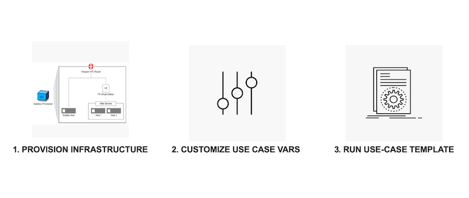

Class 10: Mastering Imperative and Declarative Automation with F5 BIG-IP
========================================================================

`Last updated: 2025-02-21 11:00 AM MT`

OVERVIEW
--------

The use case templates are built for the F5 UDF environment. These use cases can be adapted to any environment. Feel free to take, fork, or expand upon this code!

With a F5 UDF environment and these scenario use cases, users can/will be able to

- Understand the differences between **Imperative** (iControl REST API) and **Declarative** (AS3) automation.
- Test common deployment scenarios using Imperative coding and compare them with their Declarative counterparts.
- Test deployments with Ansible Automation Platform.

.. attention:: 

   This content is built by F5 Business Development organization. New content will be added periodically to provide additional automation senarios. Please open a github issue for any new feature request.

HOW TO USE
----------

**1. PROVISION INFRASTRUCTURE**

   To provision a lab, reach out to an F5 Account Manager or Sales Engineer at F5 to deploy this UDF Lab (BIG-IP & Ansible Labs - 101 and 201)

**2. Examine the Ansible-Use-Case Code via Github**

   - Examine the use case code via Github - ` <https://github.com/f5devcentral/f5-bd-ansible-labs>`_
    
   
**3. When Using F5 UDF Environment & Ansible Inventory File**

   When using the F5 UDF environment, everything is configured and setup correctly, use the instructions on how to access your lab given to you by either your F5 instructor or by the UDF Instructions Email.   
   

**4. Launching VScode (Code Server) from the UDF environment**
   
   - Within your UDF Environment deployment find the "Ansible-Node" click on the "Access" link and select "Code Server" to launch a VSCode Server instance.
   - When Asked for a password the common password between all items is Ansible123!
   - Make sure to check the checkbox to "Trust the authors of all files in the parent folder 'home'" and click "Yes, I trust the authors"
   - Open a terminal session within VSCode by going to the top menus and selecting Terminal --> New Terminal (or press CTRL+SHIFT+C)

**5. RUN USE CASE TEMPLATES**

   Start with Use-Cases (Click the following link) to begin - `Use-Case 00 <https://clouddocs.f5.com/training/community/automation/html/class10/Modules/00-Backup-Restore-Role.html>`_ 

   .. note::

      Keep the BIG-IP login (admin/Ansible123!) handy to login and validate configuration when use cases are executed
   
Support
-------

   This project is a community effort to promote Network and Security automation and is maintained by F5 Business Development (BD). For anyfeature requests or issues, feel free to open an `issue <https://github.com/f5devcentral/f5-bd-ansible-labs/issues>`_ and we will give our best effort to address it.

.. note::

   Need help with automating use cases not present here - `Open a request <https://github.com/f5devcentral/f5-bd-ansible-labs/issues>`_

 
Modules Labs
------------

.. toctree::
   :glob:
   :maxdepth: 2
   :Caption: 401 Modules Labs

   Modules/*

AS3 Labs
--------

.. toctree::
   :glob:
   :maxdepth: 2
   :Caption: 401 AS3 Labs

   AS3/*
   