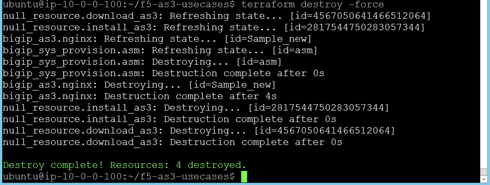

Destroy the Configuration #12.2
=================================
We already saw that we have deployed the Virtual Server, Pool and members using the declaration "example1.json"
To delete the configuration we can use Terraform. Below is the command to delete the configuration

.. code-block:: shell

  terraform destroy -force

- Please see the screen shot after the command

.. Note:: the " -force" is used just to avoid the interactive dialog of "yes/no" when we use the destroy command. 
