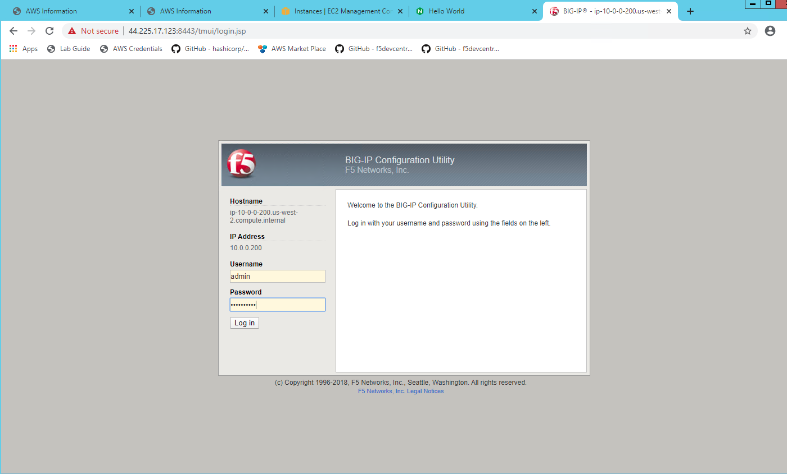

Review BIG-IP Configuration #12
================================
- Login to BIG-IP to check the configuration
- To get Management IP & password for BIG-IP do the following

.. code-block:: shell
  
  cat terraform.tfvars
  address  = "44.225.17.123:8443"
  username = "admin"
  password = "j7fVozXeUS"
 

Open the browser and issue the following command on the browser. 

.. code-block:: shell

  https://BIG-IP-Management_IP:8443

