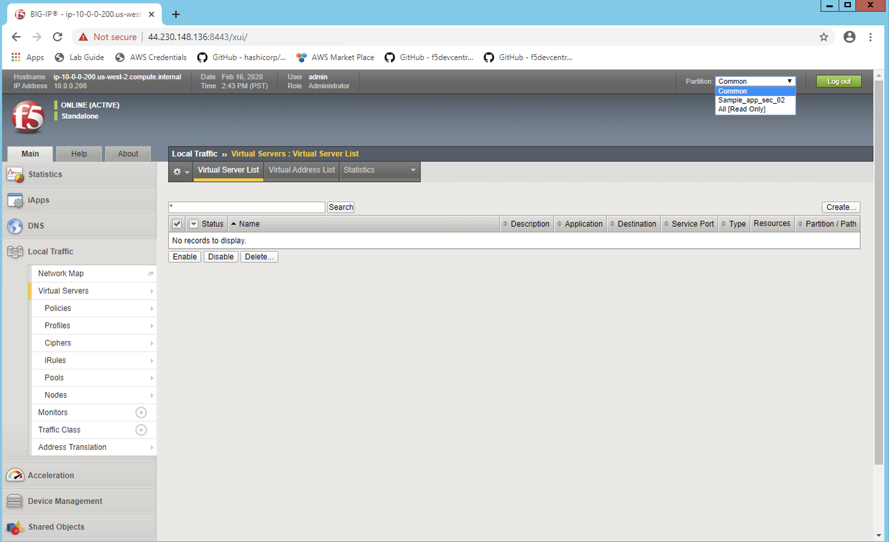
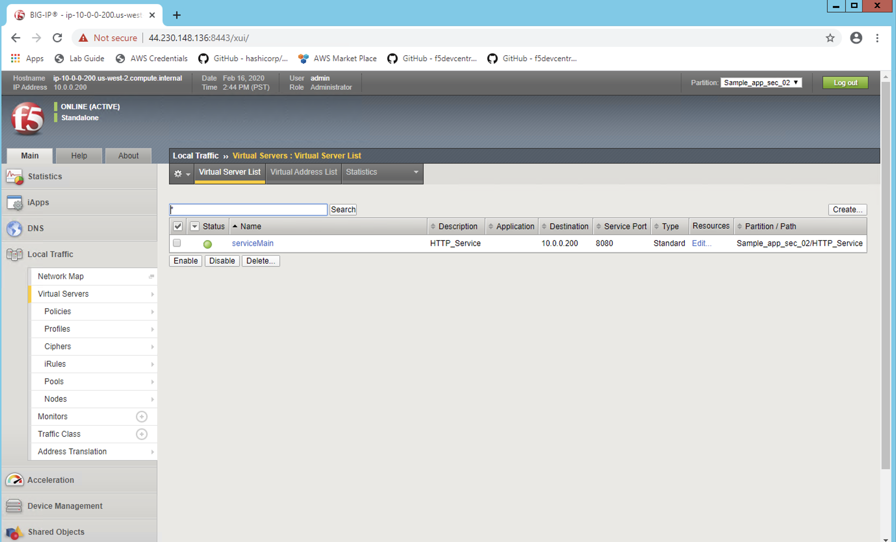
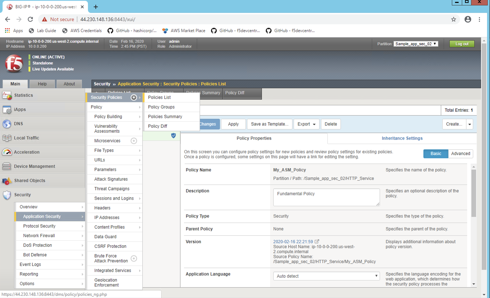
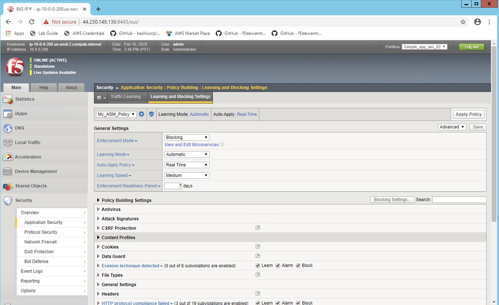

Lets see the configuration on BIG-IP  #17  
==========================================

Login into BIG-IP
-----------------
Login information for BIG-IP like the Public IP, username and password can be found in  file terraform.tfvars

.. code-block:: shell

  cat terraform.tfvars

1.Copy the BIG-IP Management IP from terraform.tfvars file

2.Open the browser and do  https://address:8443 and login with admin/password

3.Click on Local traffic menu on the left 

4.Select "Sample_app_sec_02" Partition from the extreme right

1.Verify the Virtual Server named "serviceMain" 

2.Destination IP "10.0.0.200" which matches to what we have it in the waf_http.josn file

1.Click on the Security Option and check "My_ASM_Policy" is the Application Security Policy attached.

.. image:: ./images/bigip3.png

1.Click on the Security Menu on the extreme left

2.Click on the Policy List, you will see the same policy in Basic Mode.

1.Remain in the Application Security menu click on "Learning and Blocking Settings"

2.The Enforcement mode is "Blocking" and you can see other security properties

.. image:: ./images/bigip5.png

1.Click on "View Learning & Blocking Settings" to see more details

 

 
.. Note:: These are all ASM WAF related details ......

