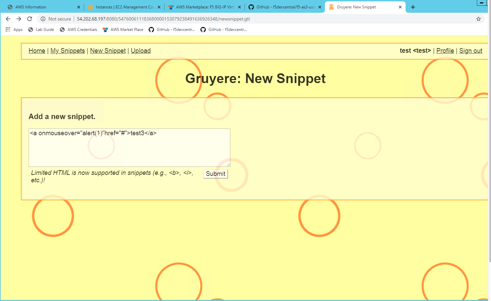
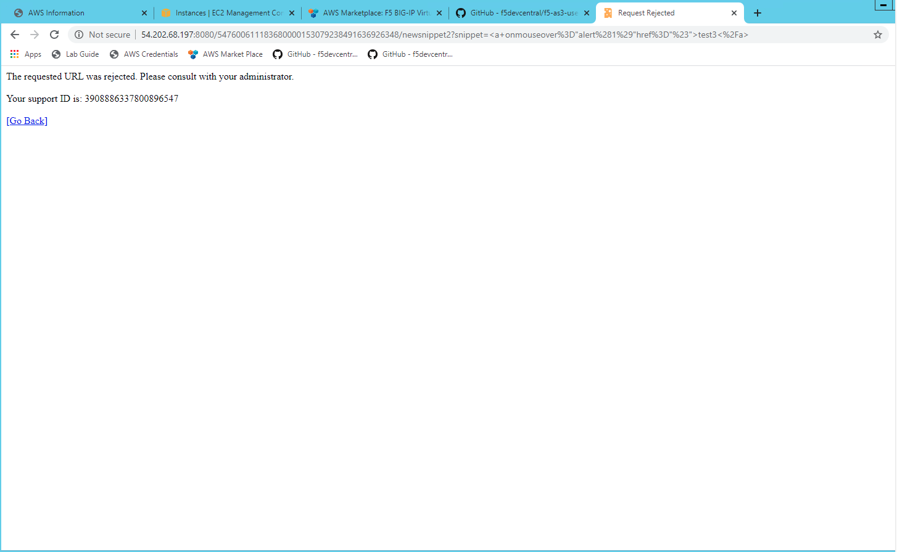
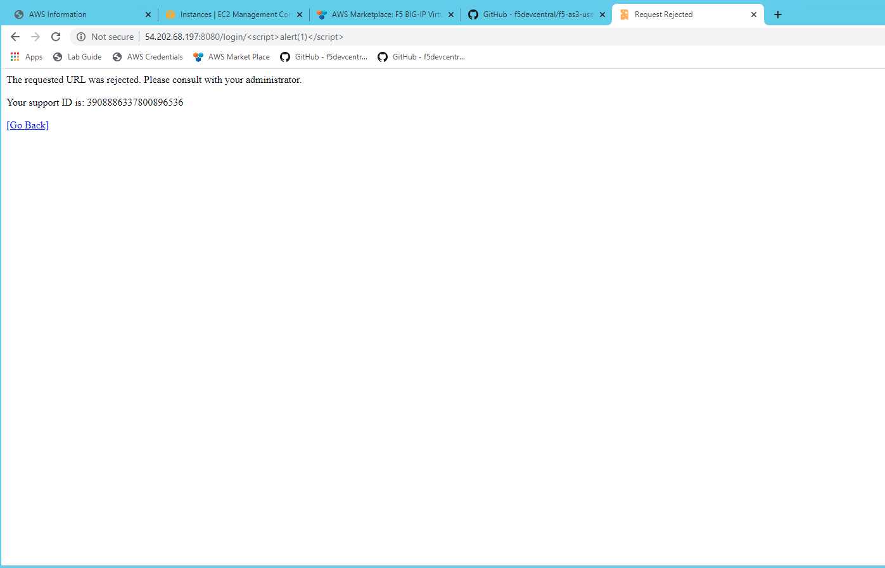

Test Application again after WAF enabled #18 
================================================
Here we will see how the application behave once we have deployed WAF with the Virtual Server

1. Sign IN into the App using test/test 

2. Click on New Snippet on the left
 
3. Add the following into box

.. code-block:: shell
  
  <a onmouseover="alert(1)"href="#">test3</a>

1. Once you hit "submit" in the previous step you will get this message 

2. " The requested URL was rejected. Please consult with your Adminsitrator "

3. This you are getting as ASM WAF is protecting your app from XSS

1. You can also test the same using following 

2. Open the browser and do the following 

.. code-block:: shell
 
   http://VIP-IP-Address:8080/login/

1. Same response you will see as shown in the earlier step.

2. Your App is protected 

 
.. Note:: These are all ASM WAF related details ......

