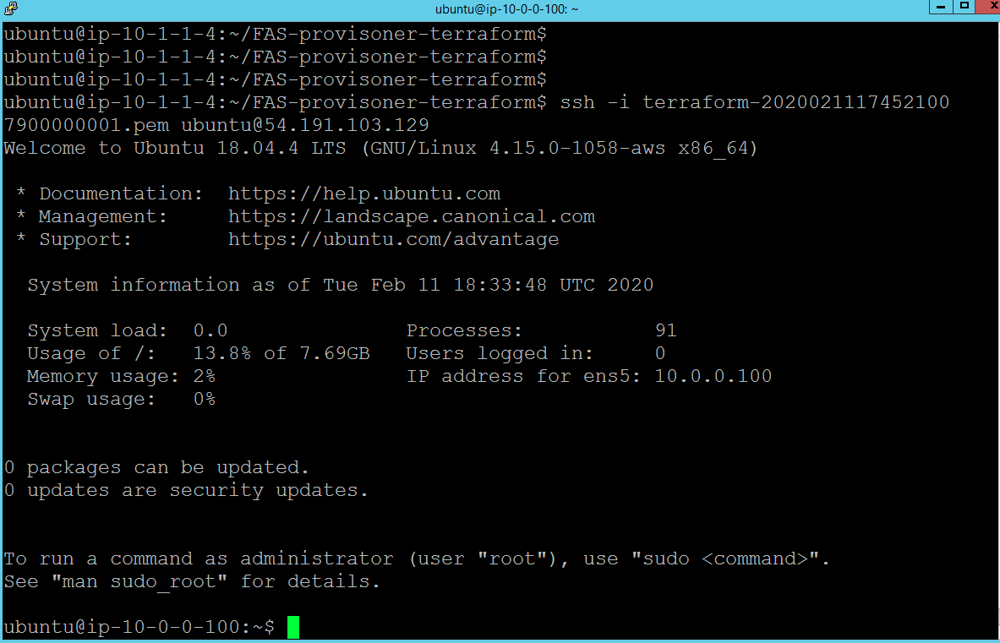

SSH into Ubuntu Jump Box Step #4
================================
On the ubuntu host run the following command.

.. code-block:: shell
                 
  $  ssh -i terraform-202002xxxxx.pem ubuntu@a.b.c.d

.. note:: terraform-202002xxxxx.pem make sure you use your own pem key from previous step. a.b.c.d IP address is the Public IP for the ubuntu jump box which we got from previous step.
