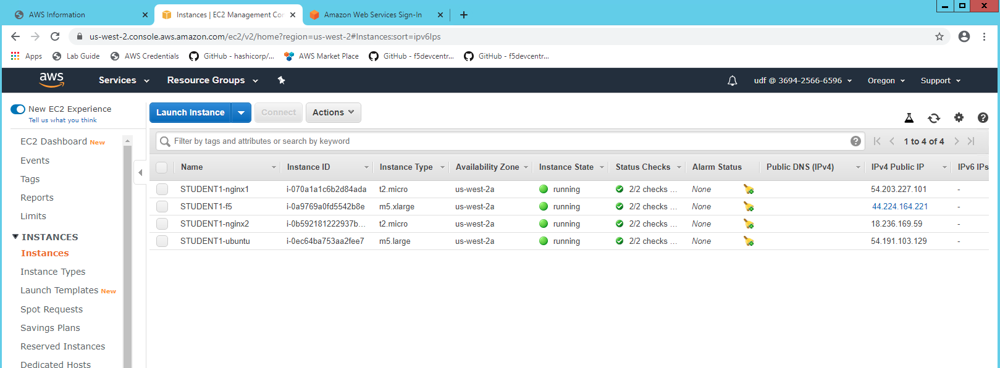

Review AWS Console Step #5
================================
- Go to the RDP Windows Server and Open the Chrome Browser 
- Click on AWS Credentials from the Bookmark and copy the AWS Password.
- Click on AWS Console link seen login using username=udf and AWS password.
- Click on Services and then EC2 instances 

.. note:: Your Student#, you will see 4 instances, 1 BIG-IP, 2 nginx servers and 1 ubuntu jump box.
