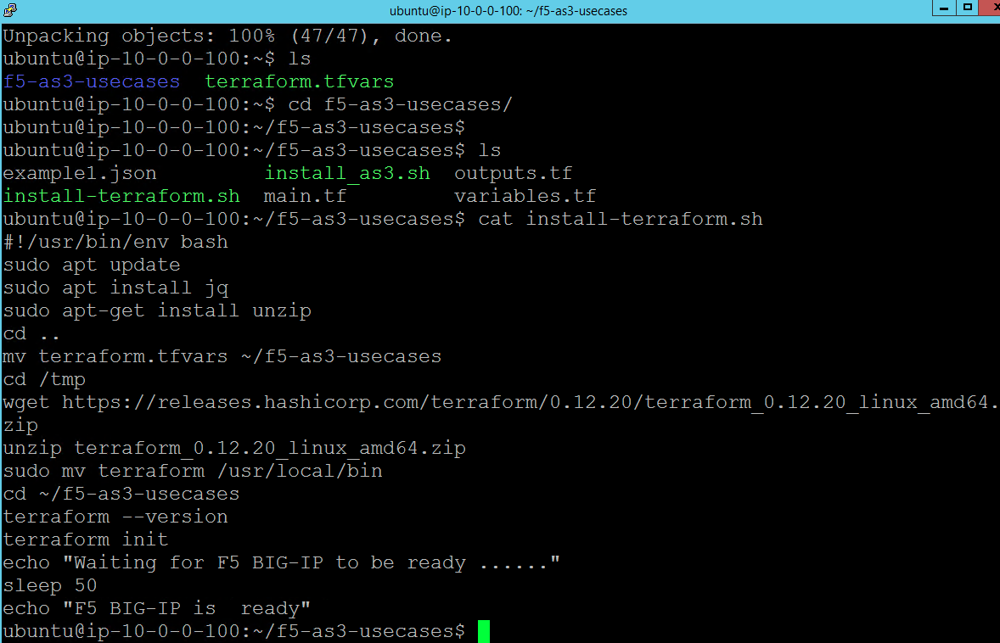
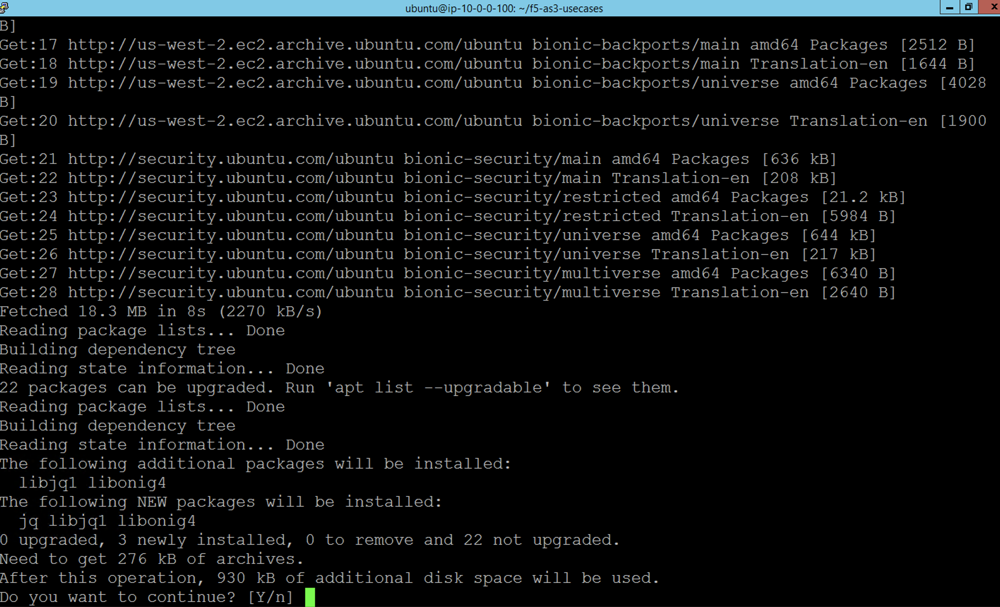

Install Terraform Step #6
================================
- From the jump box clone the repo as shown 
- Change the directory to f5-as3-usecases
- Run the terraform install script as shown below
- You can review the script below 

.. code-block:: shell
                 
  $ git clone  https://github.com/f5devcentral/f5-as3-usecases.git
  $ cd f5-as3-usecases
  $ ./install-terraform.sh

Lets review the install script below

.. code-block:: shell
  
   cat install-terraform.sh
   #!/usr/bin/env bash
   sudo apt update
   sudo apt install jq
   sudo apt-get install unzip
   cd ..
   mv terraform.tfvars ~/f5-as3-usecases
   cd /tmp
   wget https://releases.hashicorp.com/terraform/0.12.20/terraform_0.12.20_linux_amd64.zip
   unzip terraform_0.12.20_linux_amd64.zip
   sudo mv terraform /usr/local/bin
   cd ~/f5-as3-usecases
   terraform --version
   terraform init
   echo "Waiting for F5 BIG-IP to be ready ......"
   sleep 50
   echo "F5 BIG-IP is  ready"
   ubuntu@ip-10-0-0-100:~/f5-as3-usecases$

Hit 'Y' when its installing the dependencies as shown below

