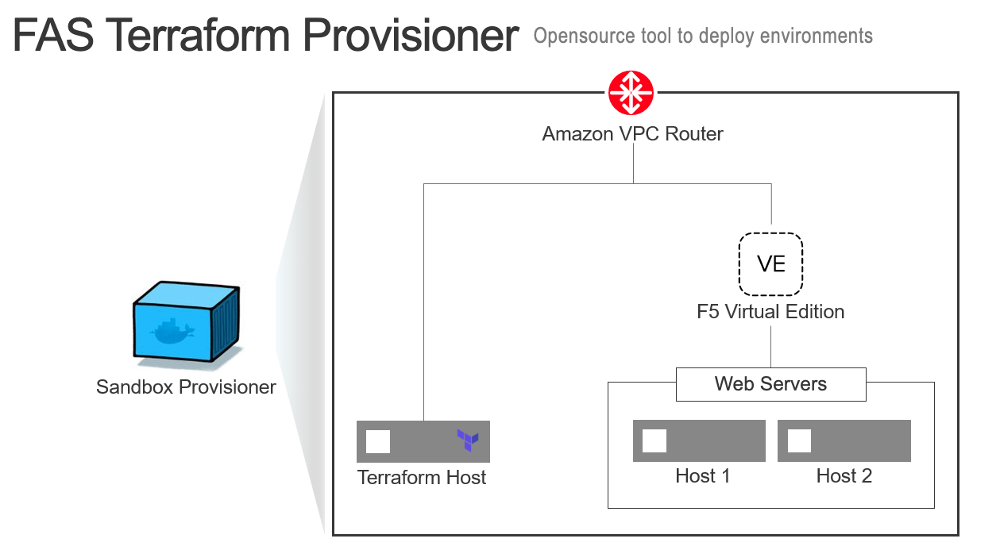

Class 11:Terraform BIG-IP Provider 
==========================================
Introduction:
-------------
1. Use FAS-terraform-provisioner to build Application infrastructure environment in AWS.
This section will deploy F5 BIG-IP, a Ubuntu Jump Box with Terraform  and Application servers in a VPC using terraform tool.

2. Configure load balancing for your application using Terraform and AS3.
Application Services 3 Extension uses a declarative model, meaning you send a declaration file using a single Rest API call.
For more details please refer to https://clouddocs.f5.com/products/extensions/f5-appsvcs-extension/latest/userguide/about-as3.html

3. Configure Web Application Firewall and protect the Application.
This section goes through how you can configure BIG-IP ASM WAF and attach to the Virtual Server using AS3 and terraform.
 

.. toctree::
   :maxdepth: 1
   :glob:
   :caption: Contents:
   

   1_step_aws_console                         
   2_aws_market_place                         
   module*/module*                            
   4_ssh_into_ubuntu_server
   5_lets_review_aws 
   6_install_terraform
   7_review_tf
   7.1_review_tf
   7.2_review_tf
   8_review_json 
   9_terraform_commands
   10_terraform_commands
   11_how_to_test
   12_review_bigip
   12.1_review_bigip
   12.2_destroy
   13_secure_your_app
   14_modify_main_tf
   15*
   16*
   17*
   18*
   19*
   
Expected time to complete: **1.5 hour**

