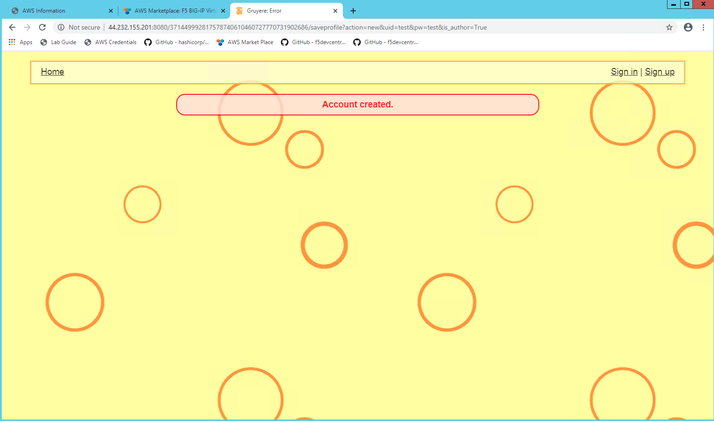
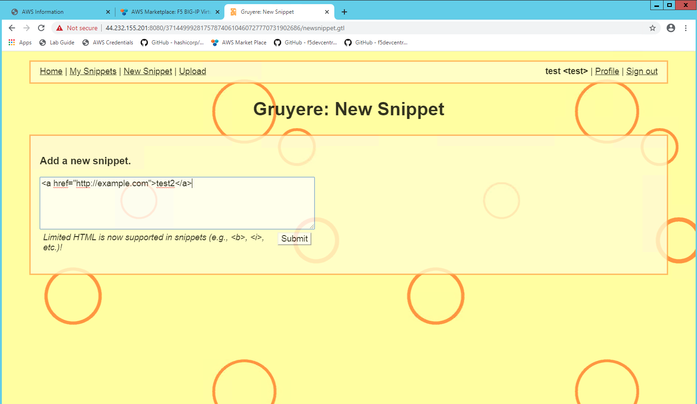
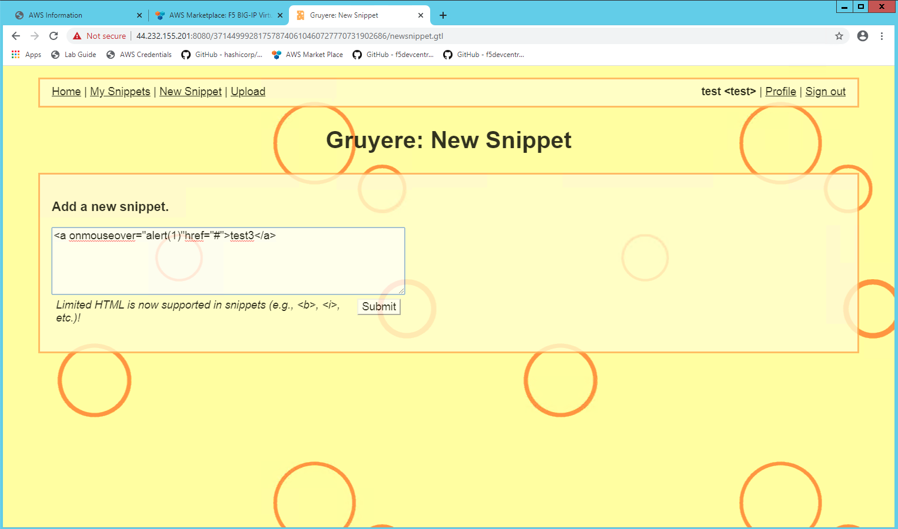

Test backend application #11
============================
- How to  test end to end traffic?

Open the browser and issue the following command on the browser

.. code-block:: shell

  http://BIG-IP-Virtual_IP:8080

here the BIG-IP-Virtual_IP is the Management IP of BIG-IP, notice the port we are using now to connect to the back end application is "8080"

You shoud get a response as shown below from the Gruyere  server. This is an open source server with existing vulnerabilities. This is a cheesy web application that allows its users to publish snippets of text and store assorted files. "Unfortunately," Gruyere has multiple security bugs ranging from cross-site scripting and cross-site request forgery, to information disclosure, denial of service, and remote code execution. The goal of this lab is to guide you through discovering some of these bugs and learning how we can fix this using F5 Advanced Web Application Firewall and protect theapplication from Cross Site Scripting. More information on the App is at https://google-gruyere.appspot.com/

.. image:: ./images/gruy1.png

1. Lets create a "test" account
2. Click on the Sign up button on the extreme right
3. Enter username & password as test/test and login with same credentials

1. Click on the New Snippet button on the extreme left
2. Add a new snipped <a href="http://example.com">test2</a>
3. We are creating a snippet which will create a pointer to a web site
4. This means we can create forms and also use the application

1. Now lets see if this application has Cross Scripting Vulnerabilities
2. Click on the New Snippet button again and add a new snipped as <a onmouseover="alert(1)"href="#">test3</a>
3. Submit the form and see what happens

1. You will see that the application exposes the XSS vulnerabilites

.. image:: ./images/gruy5.png

1. Another test you can do is logout from the Website 
2. Do http://VIP-IP-Adress:8080/login/

.. image:: ./images/gruy7.png

1. You will see the response back when we try to inject script.
2. This is vulnerable application and we need to protect users from accessing the same.

.. image:: ./images/gruy8.png

