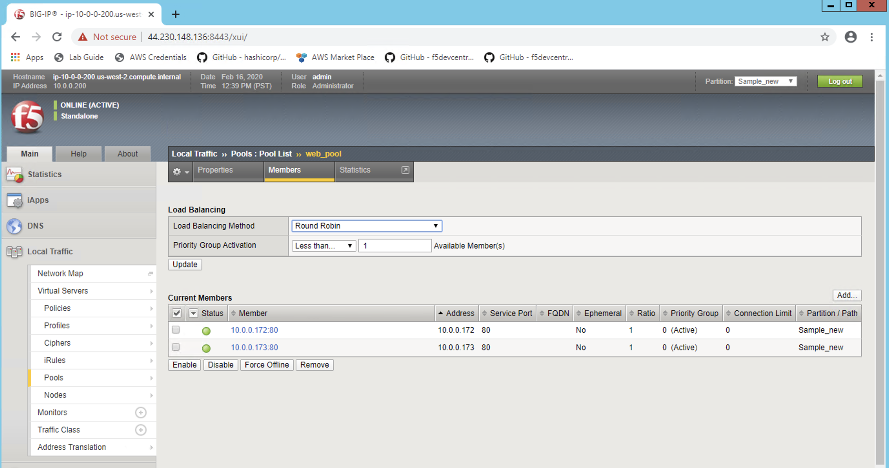
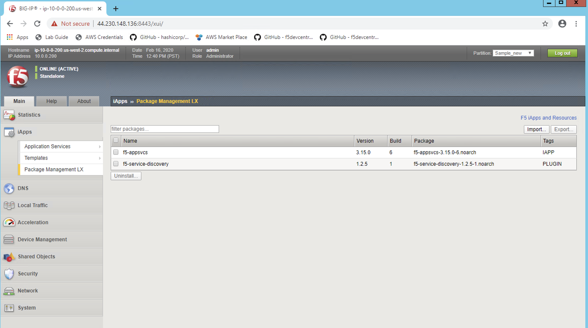

Review BIG-IP Configuration #12.1
=================================
- Login to BIG-IP to check the configuration using browser

.. image:: ./images/f5sv.png

- Lets check the Virtual Server Configuration

.. image:: ./images/vip.png

- Check what is the Pool configured

.. image:: ./images/pool.png

- Pool members or nginx server nodes

- AS3 Package Management RPM installed 

