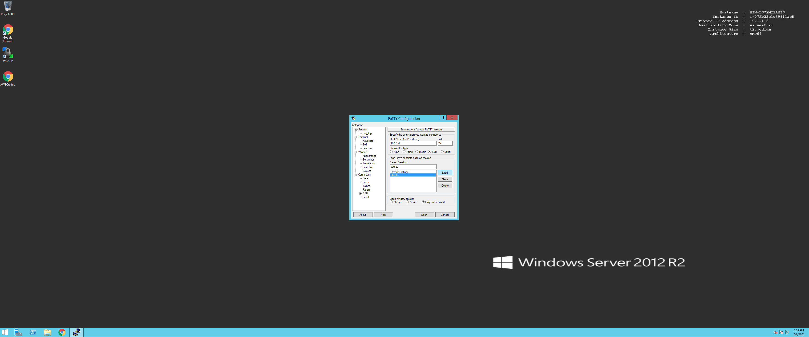

Login to ubuntu & Clone
=======================

Open up Putty on the Windows 2012 device and select the ubuntu host.

On the ubuntu host run the following command.

.. image:: ../images/clone.png

Now lets download the terraform Provisioner frm GitHub. Use the below commands.

.. code-block:: shell
   
  $ git clone https://github.com/f5devcentral/FAS-provisoner-terraform.git
  $ cd FAS-provisoner-terraform

