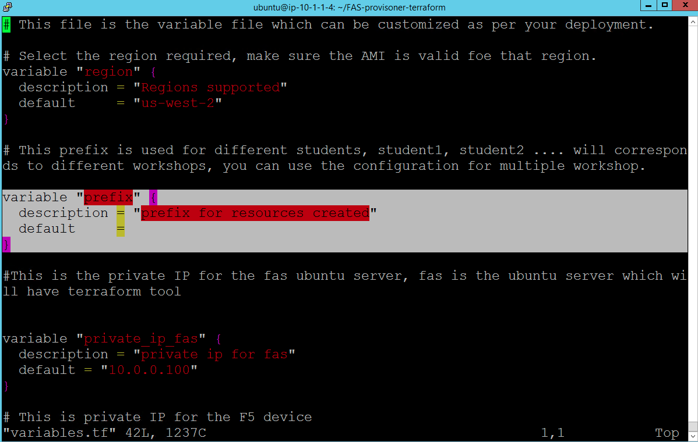

Assign Student ID
=================

Every Student will have ID which is a integer number like 1, 2, 3 ....n
Please update the "prefix" with appropriate student ID.

.. code-block:: shell

  $ cd ~/FAS-provisoner-terraform/
  $ ls
  $ vi variables.tf
  variable "prefix" {
  description = "prefix for resources created"
  default     = "Student-#"
  }

Replace '#' with your Student number

To save the variable file use :wq!

.. WARNING:: PLEASE ASSIGN UNIQUE STUDENT ID GIVEN TO YOU !!!!! ELSE LAB WILL FAIL

