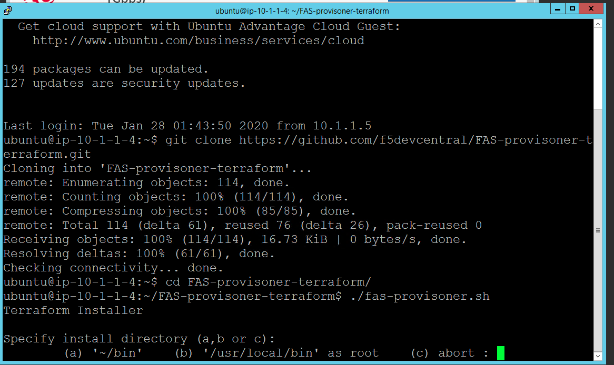
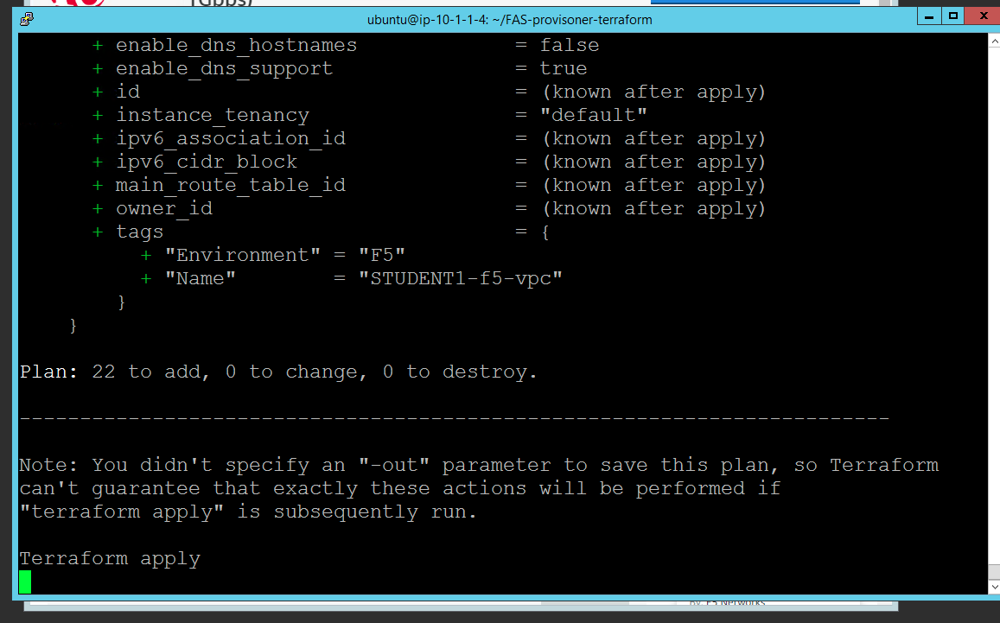
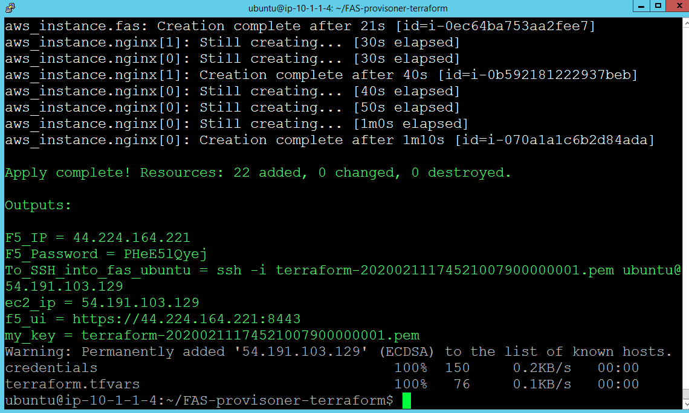

Script Execution
================
Go into the FAS-provisoner-terraform directory if you are not and do the following
Execute the shell script 

.. code-block:: shell

  cd FAS-provisoner-terraform
   $ ./fas-provisoner.sh

You can specifiy install directory for terraform hitting 'a' on keyboard please
see below

You will see 22 Plan resources terraform is about to Deploy in AWS.

Notice below the 'Outputs' for F5 BIG-IP Public IP, ubuntu Jump Box Access details...

