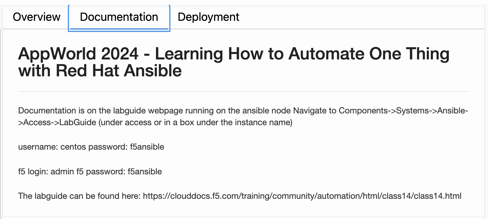
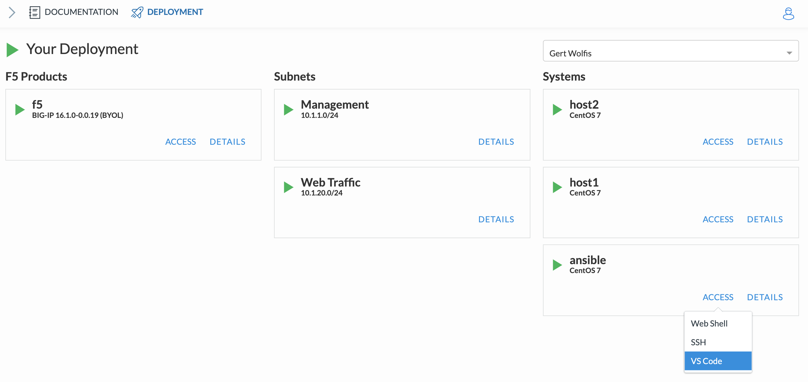
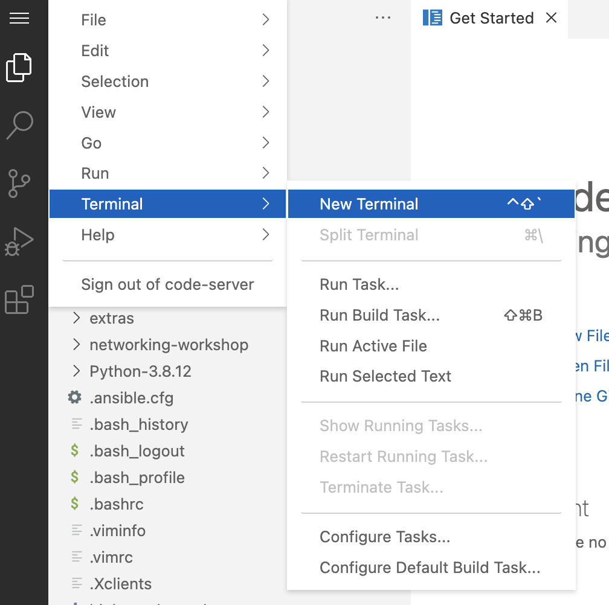
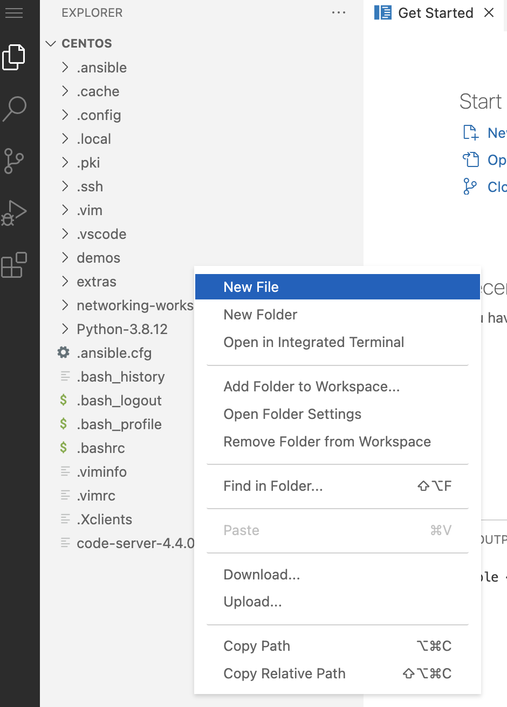

.. _0.0-getting-started:

Exercise 0.0: Getting Started
###########################################

During this lab Visual Studio Code will be used as the editor of choice and also provides a terminal to run Ansible playbooks and watch the logging accordingly.

Follow the steps below to start using VS Code in your local browser during this lab.

Step 1
------

If you already haven't done so. Use the UDF deployment to go to the **Documentation** section and grab the lab guide: https://clouddocs.f5.com/training/community/automation/html/class09/class09.html |labguide|

Step 2
------

In the UDF deployment, go to the **Deployment** section, search the **Ansible host** and click **Access** and select **VS Code**. |vscode_access|

Your local browser will start up VS Code.

Step 3
------

Check the box to Trust the authors and click the button **Yes, I trust...**.

**Ignore** the pop-up error windows in the bottom-right of your browser by **closing** them.

Step 4
------

Go to the left side of the screen and select the **three stripes**. Then go to **Terminal** and select **New Terminal**. |terminal|

The **Terminal Pane** section will appear at the bottom and change the view from **Output** to **Terminal**. |vscode_pane|

.. |vscode_pane| image:: vscode_pane.png

You can use the **terminal Pane** to launch **Ansible playbooks** and execute **Shell** commands during the lab.

Step 5
------
Note:  There are copies of the lab scripts located under the folder "networking-workshop" in the explorer pane on the left that can be used for error checking and copy/paste needs.

**Note 2:  When you navigate to the folders and click files the Terminal may switch back to Ouput and errors may pop up on bottom right.  Just click back to Terminal tab and close the error pop ups.**

In order to be able to deploy those Ansible playbooks, you need to create YAML scripts which will become your ansible-playbooks.
In **VS Code Explorer** in an empty space ``right-click`` and select **New File**. You do not need to actually create a file at this time so you can just click away to close. Or you can name it testing123.yml if you wish. |new_file|

..

   Note: Make sure you right-click in the 'empty' grey area. When you right-click at the height of the folder section and create a new file, that file will end up in that selected folder.

You finished the **Getting Started** section.